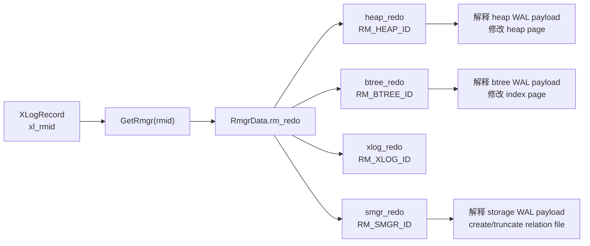
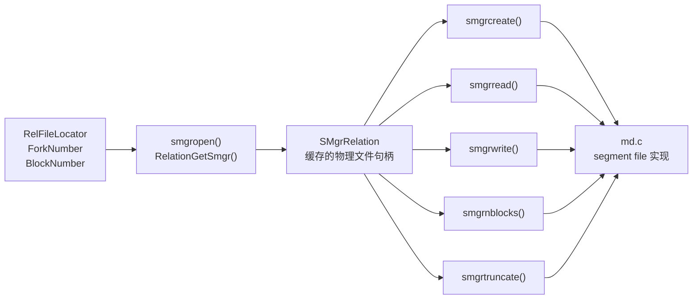
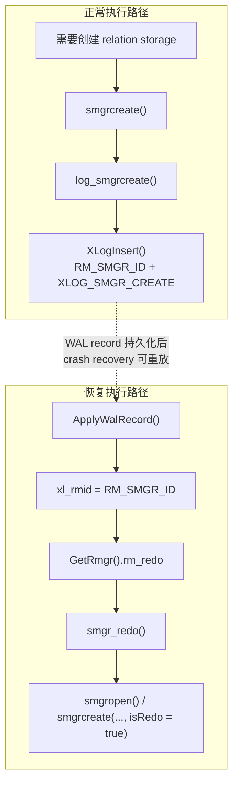
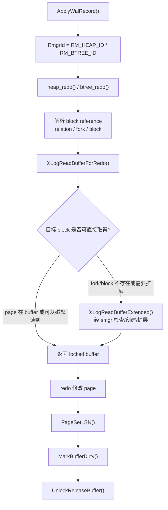

# smgr 与 rmgr

这篇用于把 PostgreSQL WAL/redo 里两个容易混淆的缩写拆开：`rmgr` 是 WAL record 的资源管理器分发层，`smgr` 是 relation 物理文件的 storage manager 抽象。二者会在 `RM_SMGR_ID` 这个 WAL 类型上相遇，但它们不是同一个层次的概念。

一句话区分：

- `rmgr`: 回答“这条 WAL record 属于哪个子系统，应该由哪个 redo 函数解释和应用？”
- `smgr`: 回答“这个 relation/fork/block 对应的物理文件如何打开、创建、扩展、读取、写入、截断？”

## 1. rmgr 是什么

`rmgr` 是 resource manager 的缩写。在 PostgreSQL WAL 中，每条 WAL record 都有一个 `RmgrId`，表示这条 record 由哪个子系统负责解释。

例如：

- `RM_XLOG_ID`: WAL/checkpoint/recovery 自身相关的 record。
- `RM_XACT_ID`: transaction commit/abort 等事务状态相关 record。
- `RM_SMGR_ID`: relation 存储文件 create/truncate 等 storage manager 相关 record。
- `RM_HEAP_ID`: heap table insert/update/delete 等 record。
- `RM_BTREE_ID`: btree index insert/split/delete 等 record。

为什么需要 rmgr？

WAL record 不是统一格式的“SQL 日志”。heap insert、btree split、事务提交、relation truncate 的 payload 完全不同。如果 recovery loop 自己理解所有 record，会变成一个巨大的集中式分支。PostgreSQL 用 `RmgrId` 把 WAL record 分发给对应模块：heap 模块理解 heap WAL，btree 模块理解 btree WAL，smgr 相关 WAL 由 storage/catalog 层的 redo 函数处理。

源码阅读路径：

- `src/include/access/rmgr.h`
  - 重点看 `RmgrId`。
  - 重点看通过 `PG_RMGR(...)` 生成内置 rmgr ID 的方式。
- `src/include/access/rmgrlist.h`
  - 重点看 `PG_RMGR(RM_HEAP_ID, ...)`、`PG_RMGR(RM_BTREE_ID, ...)`、`PG_RMGR(RM_SMGR_ID, ...)`。
  - 这个文件是理解“哪些 WAL resource manager 存在”的入口。
- `src/include/access/xlog_internal.h`
  - 重点看 `RmgrData`。
  - `RmgrData` 中最关键的是 `rm_redo`，也就是该 rmgr 的 redo 回调。
  - 也可以看 `GetRmgr()`，它根据 `RmgrId` 取出对应的 `RmgrData`。
- `src/backend/access/transam/rmgr.c`
  - 重点看 `RmgrTable`。
  - 重点看 `RegisterCustomRmgr()`，它说明 rmgr 表可以注册扩展 ID，但内置 rmgr 由 `rmgrlist.h` 定义。
- `src/backend/access/transam/xlogrecovery.c`
  - 重点看 `ApplyWalRecord()`。
  - recovery 主循环读到一条 record 后，会通过 record 中的 `xl_rmid` 找到 rmgr，然后调用对应 `rm_redo`。
- `src/include/access/xlogrecord.h`
  - 重点看 `XLogRecord` 里的 `xl_rmid`。

可以把 rmgr 分发理解成下面这条链路：

```text
WAL record
  -> XLogRecord.xl_rmid
  -> GetRmgr(rmid)
  -> RmgrData.rm_redo
  -> heap_redo / btree_redo / xlog_redo / smgr_redo / ...
```

所以 rmgr 的职责边界很清楚：它负责“把 record 交给谁解释”，而不是亲自管理磁盘文件。

用流程图看，rmgr 处在 WAL record 到具体 redo 函数之间：



## 2. smgr 是什么

`smgr` 是 storage manager 的缩写。它是 PostgreSQL 访问 relation 物理存储文件的一层抽象。上层模块不应该到处直接操作文件路径、segment fd、relation 文件大小，而是通过 smgr 接口描述“我要打开这个 relation 的这个 fork”“我要读这个 block”“我要把 relation 扩展到某个 block”。

smgr 关心的是物理存储对象：

- 哪个 relation：用 `RelFileLocator`/`RelFileLocatorBackend` 定位。
- 哪个 fork：`MAIN_FORKNUM`、`FSM_FORKNUM`、`VISIBILITYMAP_FORKNUM`、`INIT_FORKNUM`。
- 哪个 block：`BlockNumber`。
- 当前 relation 文件是否存在、大小是多少、是否需要扩展或截断。

为什么需要 smgr？

PostgreSQL 的 relation 文件并不只是一个简单 fd。它可能有多个 fork，一个 fork 又可能拆成多个 segment 文件；buffer manager、redo、vacuum、truncate、relation drop 等路径都需要访问这些物理文件。如果每个模块都直接处理这些细节，代码会高度重复，也更容易破坏缓存和同步语义。smgr 把 relation 文件句柄、文件大小缓存、segment 管理和底层实现封装起来。

源码阅读路径：

- `src/include/storage/smgr.h`
  - 重点看 `SMgrRelationData` 和 `SMgrRelation`。
  - 重点看 `smgropen()`、`smgrexists()`、`smgrcreate()`、`smgrextend()`、`smgrzeroextend()`、`smgrread()`、`smgrwrite()`、`smgrnblocks()`、`smgrtruncate()`。
  - `SMgrRelationData` 可以理解为一个被缓存的 relation 物理文件句柄。
- `src/backend/storage/smgr/smgr.c`
  - 重点看 smgr 层如何缓存、打开、关闭、失效 `SMgrRelation`。
  - 这是 storage manager 抽象层本身。
- `src/backend/storage/smgr/md.c`
  - 重点看 `mdcreate()`、`mdextend()`、`mdreadv()`、`mdwritev()`、`mdnblocks()`、`mdtruncate()`。
  - `md` 是默认磁盘文件实现，真正接近 segment file 和 block I/O。
- `src/include/utils/rel.h`
  - 重点看 `RelationGetSmgr()`。
  - 它把 relcache 中的 `Relation` 和 smgr 句柄联系起来。

可以把 smgr 理解成下面这条链路：

```text
Relation / RelFileLocator / ForkNumber / BlockNumber
  -> smgropen / RelationGetSmgr
  -> SMgrRelation
  -> smgrread / smgrwrite / smgrextend / smgrtruncate
  -> md.c
  -> relation segment files
```

所以 smgr 的职责边界是“物理 relation 文件操作”，而不是“解释 WAL record 的语义”。

用流程图看，smgr 处在 relation 逻辑定位和底层文件实现之间：



## 3. RM_SMGR_ID：二者相遇的位置

最容易混淆的一点是：PostgreSQL 里有一个 `RM_SMGR_ID`。它名字里带 `SMGR`，但它是一个 rmgr ID，表示“这类 WAL record 属于 storage manager 相关操作”。

这不意味着 smgr 本身就是 rmgr。更准确地说：

- smgr 是正常运行和 redo 都会用到的物理存储接口。
- `RM_SMGR_ID` 是 WAL 分发系统里的一个资源管理器编号。
- `RM_SMGR_ID` 对应的 redo 函数是 `smgr_redo()`。
- `smgr_redo()` 在恢复 relation create/truncate 这类 WAL record 时，会调用 smgr 接口完成物理文件操作。

典型流程是 relation 文件创建：

```text
正常执行路径
  -> RelationCreateStorage / 其他创建 relation storage 的路径
  -> smgrcreate
  -> log_smgrcreate
  -> XLogInsert(RM_SMGR_ID, XLOG_SMGR_CREATE ...)

恢复执行路径
  -> ApplyWalRecord
  -> record.xl_rmid = RM_SMGR_ID
  -> GetRmgr(RM_SMGR_ID).rm_redo
  -> smgr_redo
  -> smgropen
  -> smgrcreate(..., isRedo = true)
```

源码阅读路径：

- `src/include/access/rmgrlist.h`
  - 重点看 `RM_SMGR_ID` 对应 `smgr_redo`。
- `src/include/catalog/storage_xlog.h`
  - 重点看 `xl_smgr_create`、`xl_smgr_truncate`。
  - 重点看 `log_smgrcreate()` 和 `smgr_redo()` 的声明。
- `src/backend/catalog/storage.c`
  - 重点看 `log_smgrcreate()`。
  - 重点看 `smgr_redo()`。
  - `smgr_redo()` 会处理 `XLOG_SMGR_CREATE`、`XLOG_SMGR_TRUNCATE`。

这张图把 `RM_SMGR_ID` 的连接点单独画出来：



## 4. WAL page redo 中它们如何配合

以 heap insert redo 为例，主分发先经过 rmgr：

```text
ApplyWalRecord
  -> XLogRecord.xl_rmid = RM_HEAP_ID
  -> heap_redo
  -> heap_xlog_insert
```

但 heap redo 真正要修改页面时，还需要把目标 relation/fork/block 找出来并读入 buffer。这个过程中会走到 xlogutils，再往下使用 smgr 能力：

```text
heap_xlog_insert
  -> XLogReadBufferForRedo
  -> XLogReadBufferForRedoExtended
  -> XLogReadBufferExtended
  -> smgropen / smgrnblocks / smgrcreate / relation extension path
  -> buffer manager
  -> page modification
```

这里可以看到 rmgr 和 smgr 的层次差异：

- rmgr 决定“这条 WAL 是 heap redo 来解释”。
- heap redo 解释出 relation/fork/block/offset/tuple data。
- xlogutils/buffer manager/smgr 负责把目标 page 准备好。
- heap redo 在 page 上做具体修改，设置 page LSN，标记 buffer dirty。

源码阅读路径：

- `src/backend/access/transam/xlogrecovery.c` 的 `ApplyWalRecord()`：rmgr 分发入口。
- `src/backend/access/heap/heapam_xlog.c` 的 `heap_redo()`、`heap_xlog_insert()`：heap WAL 解释和页面修改。
- `src/backend/access/transam/xlogutils.c` 的 `XLogReadBufferForRedo()`、`XLogReadBufferForRedoExtended()`、`XLogReadBufferExtended()`：redo 读页、处理 FPI、page LSN 判断、必要时扩展 relation。
- `src/include/storage/smgr.h` 和 `src/backend/storage/smgr/smgr.c`：xlogutils 往下访问 relation 文件时依赖的 smgr 接口。

把普通 page redo 串起来，可以这样看：



## 5. 常见追问

### smgr 是 rmgr 的一种吗？

不是。`RM_SMGR_ID` 是 rmgr 的一种，smgr 不是 rmgr 的一种。

`RM_SMGR_ID` 表示“storage manager 相关 WAL record 的资源管理器编号”。而 smgr 是一套物理存储访问接口。它们的名字相近，是因为某些 storage manager 操作需要写 WAL，并在 recovery 时由 `smgr_redo()` 恢复。

源码上可以这样区分：

- rmgr ID 和分发表：`src/include/access/rmgrlist.h`、`src/backend/access/transam/rmgr.c`。
- smgr 接口和实现：`src/include/storage/smgr.h`、`src/backend/storage/smgr/smgr.c`、`src/backend/storage/smgr/md.c`。
- 二者连接点：`src/backend/catalog/storage.c` 的 `log_smgrcreate()` 和 `smgr_redo()`。

### heap_redo 会直接调用 smgrwrite 吗？

通常不是这样理解。heap redo 的主线是通过 `XLogReadBufferForRedo()` 取得目标 buffer，然后在 buffer 内修改 page，最后 `PageSetLSN()`、`MarkBufferDirty()`、释放 buffer。实际刷盘由 buffer manager/checkpoint/bgwriter/buffer eviction/recovery end 等路径完成。

smgr 更多出现在“目标 relation/fork/block 是否存在、是否需要创建 fork、是否需要扩展到目标 block、底层读写 relation 文件”的路径里，而不是 heap redo 每改完一个 tuple 就直接 `smgrwrite()`。

源码阅读路径：

- `src/backend/access/heap/heapam_xlog.c` 的 `heap_xlog_insert()`。
- `src/backend/access/transam/xlogutils.c` 的 `XLogReadBufferForRedo()`。
- `src/backend/storage/buffer/bufmgr.c` 的 `MarkBufferDirty()`、buffer 刷盘相关路径。

### 为什么 relation create 通常要先于具体 page redo？

因为 page redo 最终要定位到 relation/fork/block。如果对应 relation 文件或 fork 根本不存在，后续读页、扩展页面就没有物理承载对象。

因此 relation storage create/truncate 这类结构性变化也要写 WAL。恢复时，先通过 `RM_SMGR_ID` 的 WAL record 恢复物理文件状态，再回放 heap/btree 等页面修改 record，才能让 page redo 找到正确目标。

源码阅读路径：

- `src/backend/catalog/storage.c` 的 `log_smgrcreate()`：记录 relation storage create。
- `src/backend/catalog/storage.c` 的 `smgr_redo()`：恢复 create/truncate。
- `src/backend/access/transam/xlogutils.c` 的 `XLogReadBufferExtended()`：redo 读页时如何处理 relation/fork/block。

### smgr 是否负责事务语义？

不负责。smgr 不判断事务提交、可见性、MVCC，也不解释 heap tuple 的 `xmin`、`xmax`。它只提供物理文件级能力。

事务语义属于更高层：

- WAL record 的事务状态由 transaction rmgr 处理。
- heap tuple 的可见性相关字段由 heap/access 层维护和 redo。
- relation 文件的物理存在、大小、读写由 smgr 处理。

### FSM 和 visibility map 是否也通过 smgr 访问？

从物理存储角度看，它们都是 relation 的不同 fork，因此底层也会通过 smgr 定位和访问文件。但语义上，FSM 表示空闲空间近似信息，visibility map 表示 heap page 的 all-visible/all-frozen 状态，它们的 WAL/redo 解释不由 smgr 语义决定。

可以按层次理解：

- `ForkNumber` 区分 main/fsm/vm/init fork。
- smgr 负责“哪个 fork 的哪个 block 怎么读写”。
- heap、visibility map、FSM 相关模块负责“这个 block 里的内容是什么意思”。

源码阅读路径：

- `src/include/common/relpath.h` 和 `src/include/storage/relfilelocator.h`：relation 物理定位相关结构。
- `src/include/storage/smgr.h`：smgr 以 `ForkNumber` 作为参数访问不同 fork。
- `src/backend/access/heap/visibilitymap.c`：visibility map 语义。
- `src/backend/storage/freespace/freespace.c`：FSM 语义。

## 6. 记忆方式

可以用下面这张表快速定位两者：

| 概念 | 主要问题 | 关键结构/函数 | 典型文件 |
| --- | --- | --- | --- |
| `rmgr` | WAL record 属于谁，redo 交给谁 | `RmgrId`、`RmgrData`、`GetRmgr()`、`rm_redo` | `src/include/access/rmgrlist.h`、`src/backend/access/transam/rmgr.c`、`src/backend/access/transam/xlogrecovery.c` |
| `smgr` | relation 物理文件如何访问 | `SMgrRelationData`、`smgropen()`、`smgrcreate()`、`smgrread()`、`smgrwrite()`、`smgrnblocks()`、`smgrtruncate()` | `src/include/storage/smgr.h`、`src/backend/storage/smgr/smgr.c`、`src/backend/storage/smgr/md.c` |
| `RM_SMGR_ID` | storage manager 相关 WAL 如何 redo | `log_smgrcreate()`、`smgr_redo()`、`XLOG_SMGR_CREATE`、`XLOG_SMGR_TRUNCATE` | `src/include/catalog/storage_xlog.h`、`src/backend/catalog/storage.c` |

最短总结：

```text
rmgr = WAL redo 的分发与责任归属
smgr = relation 物理文件和 block I/O 的抽象
RM_SMGR_ID = smgr 相关操作写入 WAL 后，在 rmgr 分发体系中的编号
```
