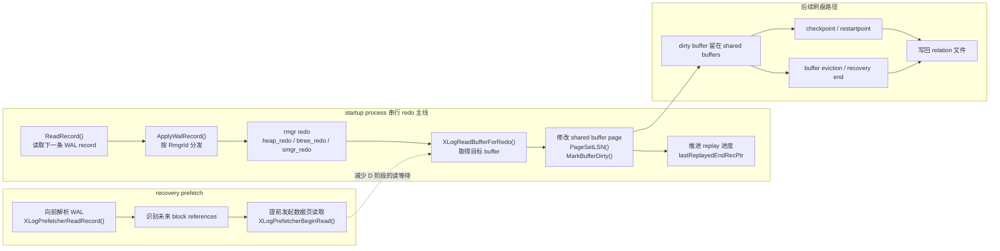
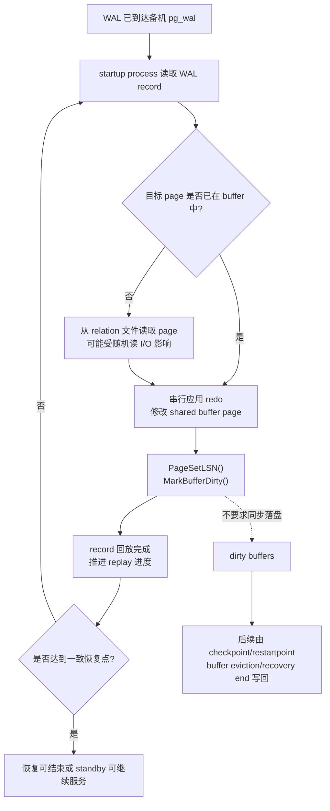

# PostgreSQL Replay Modes

这篇回答一个基础问题：如果以串行回放、并行回放、极致 RTO 回放作为参照，PostgreSQL 社区版备机里有几种回放方式？

第一版结论：

- 如果按“redo 执行模型”划分，PostgreSQL 社区版核心只有一种：startup process 串行回放 WAL record。
- PostgreSQL 有不同的 WAL 来源和恢复场景，例如 crash recovery、archive recovery、streaming standby，但它们不是不同的 redo 执行模式。
- PostgreSQL 有 `recovery_prefetch` 这样的恢复预读优化，它可以降低 replay 时的 I/O 等待，但它不是并行 redo，也不是类似 Gauss 极致 RTO 的多线程 apply 架构。

## 1. 先定义“回放方式”

为了避免概念混在一起，这里把“回放方式”拆成三层：

1. WAL 来源：WAL 从哪里来。可能来自本地 `pg_wal`、归档、或者 walreceiver 流复制接收。
2. redo 执行模型：谁来解析和应用 WAL record。核心问题是单线程串行 apply，还是多 worker 并行 apply。
3. recovery 优化：不改变 WAL record 应用顺序，但通过预读、I/O 合并、延迟控制等降低等待。

用这个口径看，PostgreSQL 的答案是：

| 维度 | PostgreSQL 社区版 |
| --- | --- |
| WAL 来源 | 本地 WAL、archive restore、streaming replication |
| redo 执行模型 | startup process 单进程串行回放 |
| I/O 优化 | recovery prefetch，受 `recovery_prefetch`、`wal_decode_buffer_size`、`maintenance_io_concurrency` 等控制 |
| 是否有内核级并行 redo | 没有看到类似 Gauss 并行回放的 worker 调度模型 |
| 是否有类似极致 RTO 回放 | 没有看到对应的多线程/流水线 apply 模式；PostgreSQL 更偏向串行 redo + 预读优化 |

## 2. PostgreSQL 的核心回放模型：startup process 串行 apply

PostgreSQL 的备机 replay 主体在 startup process 中。`PerformWalRecovery()` 定位 redo 起点后进入主循环，每次读取一条 WAL record，然后调用 `ApplyWalRecord()` 应用它。`ApplyWalRecord()` 再根据 record 的 rmgr 分发到具体 redo 函数。

主干流程：

1. `InitWalRecovery()` 确定是否需要 recovery，找到 checkpoint 和 `RedoStartLSN`。
2. `PerformWalRecovery()` 从 redo 点开始读取 WAL record。
3. 主循环中检查 pause、recovery target、apply delay 等控制条件。
4. 调用 `ApplyWalRecord()` 应用当前 WAL record。
5. `ApplyWalRecord()` 调用 `GetRmgr(record->xl_rmid).rm_redo(...)`。
6. redo 成功后更新 `lastReplayedEndRecPtr`。
7. 继续读取下一条 WAL record。

源码坐标：

- `src/backend/access/transam/xlogrecovery.c` 的 `InitWalRecovery()`：确定 checkpoint、redo 起点和 recovery 状态。
- `src/backend/access/transam/xlogrecovery.c` 的 `PerformWalRecovery()`：WAL recovery 主循环。
- `src/backend/access/transam/xlogrecovery.c` 的 `ReadRecord()`：从 xlog prefetcher/reader 读取下一条 WAL record。
- `src/backend/access/transam/xlogrecovery.c` 的 `ApplyWalRecord()`：应用单条 WAL record。
- `src/include/access/rmgrlist.h` 的 `PG_RMGR(...)`：rmgr 到 redo 函数的注册表。

为什么说它是串行回放？

因为主 apply loop 的形态是“读一条 record -> apply 这一条 -> 再读下一条”。当前源码中没有看到把 WAL record 分发给多个 redo worker 并行执行的调度层，也没有看到类似 page worker、txn worker、LSN dependency graph 的并行 redo 框架。

还有一个很关键的源码注释：`src/backend/access/transam/README` 在 “Writing a REDO routine” 部分说明，recovery 中只有 startup process 会修改 data blocks，因此 startup process 可以在这个串行化前提下安全使用 `PageGetLSN()`。这也反过来说明 PostgreSQL 的 redo 设计假设不是多 worker 同时修改数据页。

## 3. WAL 来源不同，不等于回放方式不同

PostgreSQL recovery 可以从不同来源读 WAL：

- crash recovery：数据库异常退出后，从本地 `pg_wal` 读取 WAL。
- archive recovery：通过 restore command 从归档取 WAL。
- streaming standby：walreceiver 从主机接收 WAL，写入备机 `pg_wal`，startup process 再读取和 replay。

这些是 WAL 获取路径的差异，而不是 redo apply 模型的差异。最终应用 WAL record 的仍然是 startup process 的 recovery loop。

源码坐标：

- `src/backend/access/transam/xlog.c` 的 `StartupXLOG()`：启动阶段主入口，会调用 recovery 相关流程。
- `src/backend/access/transam/xlogrecovery.c` 的 `InitWalRecovery()`：判断 crash/archive/standby recovery 相关状态。
- `src/backend/access/transam/xlogrecovery.c` 的 `ReadRecord()`：根据当前状态读取 WAL record。
- `src/backend/replication/walreceiver.c` 的 `WalReceiverMain()`：standby streaming 场景下接收 WAL。
- `src/backend/replication/walreceiver.c` 的 `XLogWalRcvWrite()` 和 `XLogWalRcvFlush()`：把接收到的 WAL 写入并 flush 到备机本地。

为什么 walreceiver 不算 replay worker？

walreceiver 只负责接收和落盘 WAL，不负责把 WAL record 应用到数据页。真正的数据页 redo 仍发生在 startup process 中。walreceiver 推进的是 receive/flush 进度，startup process 推进的是 replay/apply 进度。

## 4. recovery prefetch 是优化，不是并行回放

PostgreSQL 有 recovery prefetch：它在恢复期间提前解析 WAL，找出之后可能访问的数据块，如果这些块不在 buffer pool 中，就提前发起预读。这样可以让真正 redo 到该 record 时，相关页面更可能已经在内存里，从而减少 I/O 等待。

下面这张图突出 `recovery_prefetch` 优化的是哪一段，以及它没有改变哪一段：

这张图里最重要的点是：`recovery_prefetch` 可以让目标 page 更早进入 buffer pool，减少 `XLogReadBufferForRedo()` 等待磁盘随机读的概率；但 `ApplyWalRecord()`、具体 rmgr redo、page 修改、`PageSetLSN()`、`MarkBufferDirty()` 仍然由 startup process 串行推进。redo 修改页面后只是标脏，并不要求每条 WAL record 都同步写回磁盘。

相关配置：

- `recovery_prefetch`: 是否开启 recovery 预读，取值包括 `off`、`on`、`try`。
- `wal_decode_buffer_size`: recovery 时向前解析 WAL 的窗口大小。
- `maintenance_io_concurrency`: 限制 recovery prefetch 的并发 I/O 活动。

源码坐标：

- `src/backend/access/transam/xlogprefetcher.c`：recovery prefetch 的实现主体。
- `src/include/access/xlogprefetcher.h`：prefetcher 对 recovery reader 暴露的接口。
- `src/backend/access/transam/xlogrecovery.c` 的 `ReadRecord()`：通过 `XLogPrefetcherReadRecord()` 读取 WAL record。
- `src/backend/access/transam/xlogrecovery.c` 的 `InitWalRecovery()`：创建 `XLogPrefetcher` 并设置 WAL decode buffer。
- `doc/src/sgml/config.sgml` 的 `recovery_prefetch` 和 `wal_decode_buffer_size` 配置说明。
- `doc/src/sgml/monitoring.sgml` 的 `pg_stat_recovery_prefetch` 监控说明。

为什么 recovery prefetch 不等于并行 redo？

因为 prefetch 只是提前发起读 I/O，不负责执行 redo，也不改变 WAL record 的 apply 顺序。真正的 `ApplyWalRecord()` 仍在 startup process 的主循环中逐条执行。换句话说，它并行的是“未来可能需要的数据页读取”，不是“WAL record 的 redo 逻辑”。

## 5. RTO 与串行 redo 的瓶颈位置

RTO 受备机回放速度影响很大，但 PostgreSQL 中要区分三类耗时：读 WAL、读目标 page、应用 redo、后续刷脏页。它们不在同一个执行边界上。

因此，“写 I/O 会不会影响 RTO”要分场景看：

- redo 主循环里，最直接的 I/O stall 常常来自目标 page 不在 buffer 时的读等待。
- redo 对 page 的修改发生在 shared buffer 中，`MarkBufferDirty()` 只是标脏，不等于同步写盘。
- 如果 dirty buffer 太多、shared buffers 压力大、恢复结束或 restartpoint 需要刷大量脏页，写 I/O 会成为 RTO 或恢复尾部耗时的重要因素。
- PostgreSQL 社区版没有把 redo apply 拆成多 worker 并行执行；当读等待被 prefetch 降低后，单 startup process 串行修改 page 本身也可能成为瓶颈。

## 6. PostgreSQL 与 Gauss 三类回放的对照视角

这里不展开 Gauss 实现，只给一个对照阅读框架，方便后续你补 Gauss 细节时往里挂。

| Gauss 概念 | PostgreSQL 社区版对应理解 |
| --- | --- |
| 串行回放 | 最接近 PostgreSQL 当前核心 replay：startup process 顺序读取并 apply WAL record。 |
| 并行回放 | PostgreSQL 社区版当前没有对应的 redo worker 并行 apply 框架。 |
| 极致 RTO 回放 | PostgreSQL 社区版当前没有对应的极致 RTO apply 模式；相关优化主要是 recovery prefetch、WAL 接收/flush 与 replay 解耦、hot standby 读写冲突处理等。 |

为什么 PostgreSQL 社区版更保守？

WAL redo 的并行化难点不在“开多个线程”本身，而在依赖关系和可见性边界：

- 同一页面上的 WAL record 必须按 LSN 顺序应用。
- 一条 WAL record 可能修改多个 block，需要考虑锁顺序和一致性窗口。
- Hot Standby 查询可能同时读取页面，需要避免看到半应用状态。
- 事务状态、CLOG、subtrans、MultiXact、relation map 等状态也要和数据页 redo 协调。
- timeline、recovery target、pause/apply delay、conflict resolution 都要保持语义清晰。

PostgreSQL 的 rmgr redo 接口和大量注释默认建立在 startup process 串行 apply 的模型上。要做真正并行 redo，不只是改 recovery loop，还会影响 rmgr redo 函数、buffer locking、依赖调度、冲突处理和进度推进语义。

## 7. 回放进度：receive、flush、replay 是三条线

在 standby 场景里，经常容易把几个 LSN 混在一起：

- receive/write/flush 进度：walreceiver 接收到哪里、写到哪里、flush 到哪里。
- current replay 进度：startup process 当前正在应用到哪里。
- last replayed 进度：startup process 已经成功应用到哪里。

源码坐标：

- `src/backend/replication/walreceiver.c` 的 `XLogWalRcvFlush()`：更新 walreceiver flush 进度。
- `src/backend/access/transam/xlogrecovery.c` 的 `ApplyWalRecord()`：回放前更新 `replayEndRecPtr`，回放成功后更新 `lastReplayedEndRecPtr`。
- `src/backend/access/transam/xlogrecovery.c` 的 `GetCurrentReplayRecPtr()`：读取当前正在应用或已应用的 replay 位置。
- `src/backend/access/transam/xlogrecovery.c` 的 `GetXLogReplayRecPtr()`：读取最后成功 replay 的位置。

为什么要区分 current replay 和 last replayed？

因为一条 WAL record 开始应用和成功应用不是同一个语义。`replayEndRecPtr` 可以表示“当前 record 已进入应用阶段”，而 `lastReplayedEndRecPtr` 只有在 redo 成功后才推进。这个差异对同步复制 remote apply、walreceiver reply、walsender 观察 standby 进度等都很重要。

## 8. PostgreSQL 中容易被误认为“回放方式”的特性

下面这些都和 recovery/replay 有关，但不要直接等同于 Gauss 的回放方式分类：

- Hot Standby：允许恢复期间只读查询运行；不是新的 redo 模式。
- recovery target：PITR 停到某个时间、LSN、事务或 restore point；不是新的 redo 执行模式。
- recovery pause/resume：暂停或继续 recovery；不是新的 redo 执行模式。
- recovery apply delay：延迟 apply，用于 standby 延迟；不是新的 redo 执行模式。
- restartpoint：standby 中类似 checkpoint 的恢复边界；不是 redo 并行模式。
- recovery prefetch：提前读页面，减少 I/O stall；不是 redo worker 并行。

## 9. 后续适合继续补充的“为什么”

- 为什么 PostgreSQL recovery 中只有 startup process 修改 data blocks？
- 为什么 rmgr redo 接口天然偏向串行 apply？
- 为什么 recovery prefetch 能提升恢复速度但不能降低所有场景的 RTO？
- 为什么 receive/flush/replay 三条 LSN 进度要拆开？
- 为什么 Hot Standby 查询会和 startup process 产生 recovery conflict？
- 如果要在 PostgreSQL 上设计并行回放，需要先拆哪些依赖关系？
- Gauss 的并行回放相比 PostgreSQL 串行回放，核心多了哪些调度和一致性机制？
- 极致 RTO 回放要降低的是哪段时间：WAL 接收、WAL 解析、页面 I/O、redo apply，还是恢复一致性判定？
