# Primary To Standby WAL Flow

这张图先描述主机产生 WAL、备机接收 WAL、备机回放 WAL 的主干链路。后续补充细节时，可以把内容挂到对应节点下面：例如 WAL insert 指针推进挂到 `XLogInsertRecord()`，checkpoint 推进挂到 `CreateCheckPoint()`，备机 apply 进度挂到 `ApplyWalRecord()`。

```mermaid
flowchart LR
    subgraph Primary["主机 Primary"]
        P1["事务/存储层修改数据页"]
        P2["组装 WAL record\nXLogInsert()"]
        P3["预留 WAL 空间并复制到 WAL buffer\nXLogInsertRecord()\nReserveXLogInsertLocation()"]
        P4["推进 insert head\nInsert.CurrBytePos"]
        P5["等待相关 WAL 插入完成\nWaitXLogInsertionsToFinish()"]
        P6["写入并 flush 本地 pg_wal\nXLogFlush() / XLogWrite()"]
        P7["checkpoint 选择新的 redo 起点\nCreateCheckPoint()"]
        P8["发送已可见 WAL\nwalsender\nWalSndLoop() / XLogSendPhysical()"]
    end

    subgraph Network["复制通道"]
        N1["流复制协议\nWAL bytes + keepalive + feedback"]
    end

    subgraph Standby["备机 Standby"]
        S1["walreceiver 接收 WAL\nWalReceiverMain()"]
        S2["写入并 flush 备机 pg_wal\nXLogWalRcvWrite()\nXLogWalRcvFlush()"]
        S3["startup process 读取 WAL\nReadRecord()"]
        S4["从 checkpoint.redo 开始恢复\nInitWalRecovery()\nPerformWalRecovery()"]
        S5["应用单条 WAL record\nApplyWalRecord()"]
        S6["分发到 rmgr redo\nGetRmgr(...).rm_redo"]
        S7["推进 replay 进度\nreplayEndRecPtr\nlastReplayedEndRecPtr"]
        S8["遇到 checkpoint record 后记录 restartpoint 候选\nRecoveryRestartPoint()"]
        S9["创建 restartpoint\nCreateRestartPoint()"]
    end

    P1 --> P2 --> P3 --> P4
    P3 --> P5 --> P6
    P6 --> P8 --> N1 --> S1 --> S2 --> S3 --> S4 --> S5 --> S6 --> S7
    P7 -. "产生 checkpoint/restart 边界 WAL record" .-> P3
    P7 -. "checkpoint record 进入 WAL 流" .-> P8
    S7 --> S8 --> S9
    S9 -. "让备机下次恢复起点前移" .-> S4
```

## 主线解释

主机上，业务修改数据页之前会先生成 WAL。上层调用 `XLogInsert()` 组装 WAL record，随后 `XLogInsertRecord()` 预留 WAL 空间并把 record 复制到共享 WAL buffer。`Insert.CurrBytePos` 的推进只表示 WAL 空间已经被预留，不表示 record 已经写盘；写盘前还需要 `WaitXLogInsertionsToFinish()` 确认目标范围内的并发插入已经完成。

主机 flush 本地 WAL 后，walsender 可以把 WAL 发给备机。备机 walreceiver 接收流复制协议中的 WAL bytes，把它们写入备机本地 `pg_wal` 并 flush，同时更新接收/flush 进度。startup process 负责读取这些 WAL record，并在 recovery loop 中调用 `ApplyWalRecord()` 应用。

备机 replay 的逻辑起点来自 checkpoint record 中的 `CheckPoint.redo`。回放每条 record 时，`ApplyWalRecord()` 会先推进“当前正在应用到哪里”的 `replayEndRecPtr`，redo 成功后再推进“已经成功应用到哪里”的 `lastReplayedEndRecPtr`。具体的数据页修复由 rmgr redo 函数完成，例如 heap、btree、xact 等。

checkpoint 与 restartpoint 是这条链路上的边界机制。主机 `CreateCheckPoint()` 推进新的 redo 起点，并把 checkpoint record 写入 WAL 流；备机 replay 到安全的 checkpoint record 后，`RecoveryRestartPoint()` 会记录 restartpoint 候选，随后 checkpointer 可以用 `CreateRestartPoint()` 把备机恢复起点前移。

## 可扩展节点

- WAL 生成细节：补在 `XLogInsert()`、`XLogRecordAssemble()`、`XLogInsertRecord()` 节点下。
- insert head/tail：补在 `ReserveXLogInsertLocation()`、`WALInsertLock`、`WaitXLogInsertionsToFinish()` 节点下。
- checkpoint 推进：补在 `CreateCheckPoint()`、`CheckPointGuts()`、`CheckPoint.redo` 节点下。
- 流复制发送：补在 `WalSndLoop()`、`XLogSendPhysical()`、`WalSndWaitForWal()` 节点下。
- 备机接收：补在 `WalReceiverMain()`、`XLogWalRcvWrite()`、`XLogWalRcvFlush()` 节点下。
- 回放 apply：补在 `PerformWalRecovery()`、`ApplyWalRecord()`、`PG_RMGR(...)` 节点下。
- restartpoint：补在 `RecoveryRestartPoint()`、`CreateRestartPoint()`、`minRecoveryPoint` 节点下。

## 源码坐标

| 环节 | 文件 | 函数/结构 |
| --- | --- | --- |
| WAL record 组装入口 | `src/backend/access/transam/xloginsert.c` | `XLogInsert()` |
| WAL 空间预留和 WAL buffer 拷贝 | `src/backend/access/transam/xlog.c` | `XLogInsertRecord()`、`ReserveXLogInsertLocation()`、`CopyXLogRecordToWAL()` |
| WAL 写入和 flush | `src/backend/access/transam/xlog.c` | `XLogFlush()`、`XLogWrite()`、`WaitXLogInsertionsToFinish()` |
| checkpoint | `src/backend/access/transam/xlog.c` | `CreateCheckPoint()`、`CheckPointGuts()` |
| walsender 主循环 | `src/backend/replication/walsender.c` | `WalSndLoop()`、`XLogSendPhysical()`、`WalSndWaitForWal()` |
| walreceiver 主循环 | `src/backend/replication/walreceiver.c` | `WalReceiverMain()`、`XLogWalRcvProcessMsg()` |
| 备机 WAL 写入和 flush | `src/backend/replication/walreceiver.c` | `XLogWalRcvWrite()`、`XLogWalRcvFlush()` |
| recovery 初始化 | `src/backend/access/transam/xlogrecovery.c` | `InitWalRecovery()` |
| recovery 主循环 | `src/backend/access/transam/xlogrecovery.c` | `PerformWalRecovery()`、`ReadRecord()` |
| 单条 record 回放 | `src/backend/access/transam/xlogrecovery.c` | `ApplyWalRecord()`、`xlogrecovery_redo()` |
| redo 分发表 | `src/include/access/rmgrlist.h` | `PG_RMGR(...)` |
| replay 进度读取 | `src/backend/access/transam/xlogrecovery.c` | `GetXLogReplayRecPtr()`、`GetCurrentReplayRecPtr()` |
| restartpoint | `src/backend/access/transam/xlog.c` | `RecoveryRestartPoint()`、`CreateRestartPoint()` |

