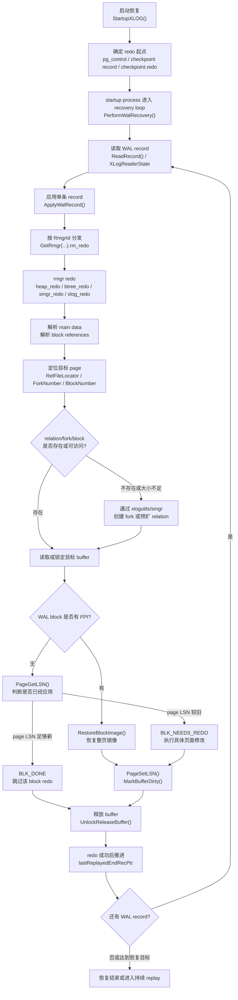
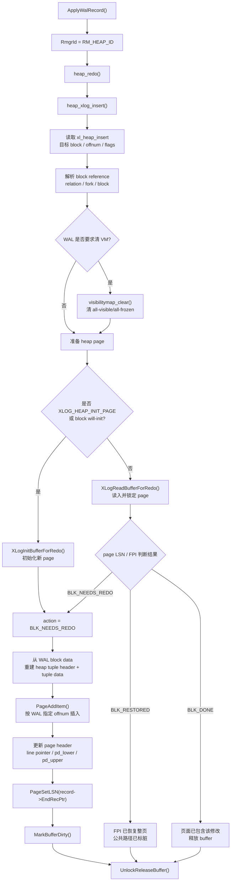
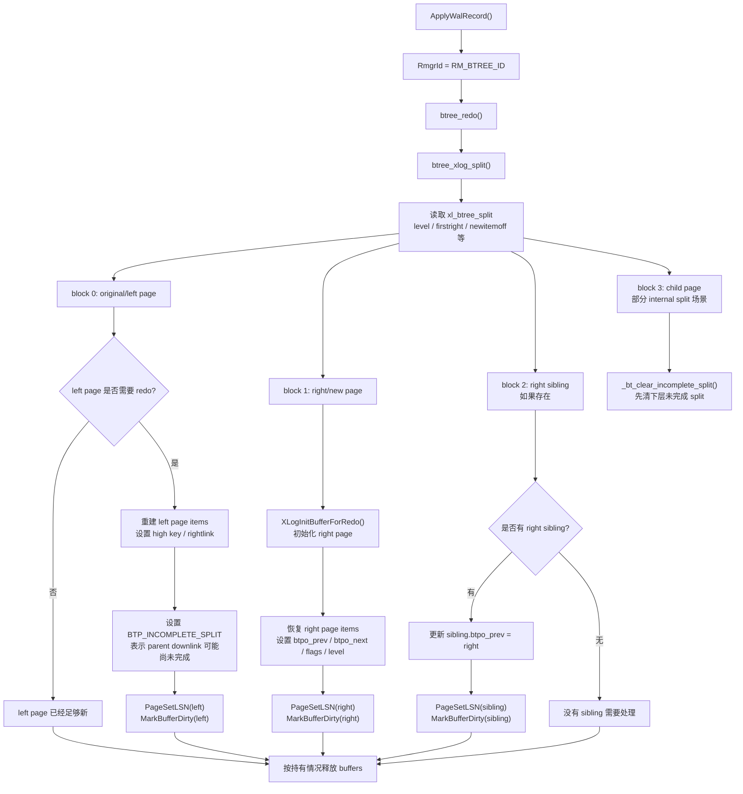

# WAL Record To Page Redo Flow

这篇按“主流程 -> 关键细节 -> 常见追问”的方式组织。重点不是背概念，而是能说清楚一条 WAL record 在 PostgreSQL recovery 中如何最终改变 page。

不同 PostgreSQL 版本函数名和局部实现可能略有差异，但核心流程一致：startup process 按 WAL 顺序读取 record，按 resource manager 分发 redo，根据 WAL 中的 block reference 定位页面，通过 full page image 或逻辑 redo 修复页面，设置 page LSN，标脏并释放 buffer。

## 0. 先讲一句话

PostgreSQL redo 不是重新执行 SQL，而是 startup process 从 checkpoint.redo 开始顺序读取 WAL record，按 record 中记录的 relation/fork/block/offset 等物理信息定位目标 page；如果 WAL 带 full page image 就直接恢复整页，否则先用 page LSN 判断是否需要重放，再调用 heap/btree/smgr 等 rmgr 的 redo 函数做页面级修改，最后 `PageSetLSN()`、`MarkBufferDirty()`、释放 buffer。

源码阅读总入口：

- `src/backend/access/transam/xlog.c`: `StartupXLOG()`
- `src/backend/access/transam/xlogrecovery.c`: `InitWalRecovery()`、`PerformWalRecovery()`、`ReadRecord()`、`ApplyWalRecord()`
- `src/include/access/rmgrlist.h`: `PG_RMGR(...)`
- `src/backend/access/transam/xlogutils.c`: `XLogReadBufferForRedo()`、`XLogReadBufferForRedoExtended()`
- `src/backend/access/heap/heapam_xlog.c`: `heap_redo()`、`heap_xlog_insert()`、`heap_xlog_update()`、`heap_xlog_delete()`
- `src/backend/access/nbtree/nbtxlog.c`: `btree_redo()`、`btree_xlog_insert()`、`btree_xlog_split()`

## 1. 主流程：一条 WAL record 如何作用到 page

可以先按这个顺序理解：

```text
pg_control/checkpoint -> checkpoint.redo
  -> startup process
  -> ReadRecord()/XLogReaderState 解析 WAL record
  -> ApplyWalRecord()
  -> GetRmgr(record->xl_rmid).rm_redo()
  -> rmgr redo 解析 block reference 和 main data
  -> XLogReadBufferForRedo* 定位/读取/初始化目标 page
  -> 如果有 full page image，restore 整页
  -> 如果没有 FPI，用 page LSN 判断是否需要 redo
  -> heap/btree/smgr 等具体修改 page
  -> PageSetLSN(record->EndRecPtr)
  -> MarkBufferDirty()
  -> UnlockReleaseBuffer()
```

主流程图可以这样看：



这张图里有两个分叉最关键：

- `relation/fork/block` 分叉：解释为什么 redo 可能需要先走 smgr/xlogutils 做文件存在性检查和预扩。
- `FPI/page LSN` 分叉：解释为什么同一条 WAL record 有时恢复整页，有时做逻辑 redo，有时直接跳过。

为什么这个流程成立？

- WAL record 已经包含足够的物理定位信息，不需要重新规划 SQL。
- recovery 必须可重复执行，所以要依赖 page LSN 实现幂等。
- 崩溃时部分数据页可能已刷盘、部分没刷盘，所以 redo 既要能跳过已应用页面，也要能补齐没落盘页面。
- full page image 解决 torn page 和 checkpoint 后首次修改页面的基准问题。
- buffer manager 仍然管理 shared buffer、锁、dirty 标记，redo 不是直接随便写磁盘文件。

源码阅读关键词：

- `PerformWalRecovery`
- `ApplyWalRecord`
- `GetRmgr`
- `XLogReadBufferForRedo`
- `PageGetLSN`
- `PageSetLSN`
- `MarkBufferDirty`

## 2. 恢复启动阶段

PostgreSQL 启动时不是从 WAL 开头回放，而是从最近 checkpoint 记录里的 `checkpoint.redo` 开始。`pg_control` 保存最近 checkpoint record 的位置和副本；恢复时先读 checkpoint record，再取出 `CheckPoint.redo` 作为 redo 起点。

为什么不是从 WAL 开头回放？

- WAL 很长，从头回放代价不可接受。
- checkpoint 承诺某个 redo 边界之前的脏状态已经刷盘到足够安全的程度。
- checkpoint 之前的 WAL 大多已经不再需要参与 crash recovery，可以被回收或归档管理。

startup process 的角色：

- 它是 recovery 中应用 WAL 的核心进程。
- 它负责读取 WAL、调用 rmgr redo、推进 replay LSN、处理 recovery target/pause/apply delay。
- PostgreSQL 的常规 recovery 模型假设只有 startup process 修改 data blocks。

源码阅读路径：

- `src/backend/access/transam/xlog.c`: `StartupXLOG()`
- `src/backend/access/transam/xlogrecovery.c`: `InitWalRecovery()`、`PerformWalRecovery()`
- `src/include/catalog/pg_control.h`: `ControlFileData`、`CheckPoint`
- `src/backend/access/transam/README`: 搜 “Only Startup process may modify data blocks during recovery”

常见追问点：

- `ControlFile->checkPoint` 是 checkpoint record 自身位置。
- `ControlFile->checkPointCopy.redo` 或 checkpoint record 中的 `redo` 才是恢复起点。
- 在线 checkpoint 的 `redo` 可能早于 checkpoint record 自身，所以不能简单从 checkpoint record 后面开始。

## 3. 读取 WAL record

WAL record 包含 header、main data、block references 以及可选 full page image。`XLogReaderState` 负责从 WAL 字节流中读取、校验、解析 record，并把 block reference 解码成后续 redo 可以使用的结构。

关键概念：

- `XLogRecord`: record header，包含总长度、事务 ID、resource manager ID、info、prev 指针、CRC 等。
- main data: rmgr 自己定义的主数据，例如 heap insert 的 tuple 相关信息、btree split 的元信息。
- block references: 描述这个 WAL record 涉及哪些 relation/fork/block，以及该 block 是否带 FPI、是否 will-init、是否有 block data。
- record LSN: record 起始位置，常用于判断 page 是否已经应用过该 record。
- `EndRecPtr`: record 结束位置，通常作为页面修改后的 page LSN。

为什么要区分 main data 和 block reference？

- main data 表示 rmgr 语义。
- block reference 表示物理页面定位。
- 一条 record 可能涉及多个 block，每个 block 可能有自己的 block data 或 FPI。

源码阅读路径：

- `src/include/access/xlogrecord.h`: `XLogRecord`、block header 标志，如 `BKPBLOCK_HAS_IMAGE`、`BKPBLOCK_WILL_INIT`
- `src/include/access/xlogreader.h`: `XLogReaderState`、`DecodedBkpBlock`
- `src/backend/access/transam/xlogreader.c`: record 读取、解析、`RestoreBlockImage()`
- `src/backend/access/transam/xlogrecovery.c`: `ReadRecord()`

建议搜索：

- `XLogReadRecord`
- `XLogReaderState`
- `XLogRecGetData`
- `XLogRecGetBlockData`
- `XLogRecGetBlockTag`
- `XLogRecHasBlockImage`
- `RestoreBlockImage`

## 4. 根据 resource manager 分发 redo

每条 WAL record 有一个 `RmgrId`，表示这条 record 属于哪个资源管理器。`ApplyWalRecord()` 会通过 `GetRmgr(record->xl_rmid).rm_redo(xlogreader)` 找到对应 redo 函数。

常见 rmgr：

- `RM_XLOG_ID`: checkpoint、end of recovery、full page image 等 XLOG 自身记录。
- `RM_XACT_ID`: transaction commit/abort/prepared transaction 等。
- `RM_SMGR_ID`: relation storage create/truncate 等。
- `RM_HEAP_ID`: heap insert/update/delete 等。
- `RM_HEAP2_ID`: heap clean、visible、freeze、多插入等扩展操作。
- `RM_BTREE_ID`: btree insert/split/delete/vacuum 等。

为什么 redo 不是重新执行 SQL？

- SQL 执行依赖优化器、锁、可见性、索引选择、约束检查等高层语义，崩溃恢复时不能也不需要重走。
- WAL 已经记录了确定的物理结果：哪个 relation、哪个 block、哪个 offset、写入什么 tuple、设置什么 flag。
- redo 要保证幂等，重新执行 SQL 可能产生不同执行计划或不同目标页面。

源码阅读路径：

- `src/include/access/rmgrlist.h`: `PG_RMGR(...)`
- `src/backend/access/transam/rmgr.c`: rmgr 表初始化
- `src/backend/access/transam/xlogrecovery.c`: `ApplyWalRecord()`
- `src/backend/access/heap/heapam_xlog.c`: `heap_redo()`
- `src/backend/access/nbtree/nbtxlog.c`: `btree_redo()`
- `src/backend/catalog/storage.c`: `smgr_redo()`

## 5. 解析 block reference 并定位页面

block reference 里最关键的是页面身份：

- `RelFileLocator`: 物理 relation 标识，包含 tablespace、database、relfilenode 等信息。
- `ForkNumber`: relation 的 fork 类型。
- `BlockNumber`: fork 内的块号。

fork 类型：

- `MAIN_FORKNUM`: heap/index 主数据。
- `FSM_FORKNUM`: free space map，记录空闲空间近似信息。
- `VISIBILITYMAP_FORKNUM`: visibility map，记录 heap page 是否 all-visible/all-frozen。
- `INIT_FORKNUM`: unlogged relation 的初始化 fork。

为什么一条 WAL record 可能涉及多个 block？

- heap update 可能同时涉及旧 tuple 页面和新 tuple 页面。
- btree split 通常涉及 left page、right page、parent page，可能还涉及 right sibling 或 metapage。
- heap 修改可能还要清 visibility map。
- smgr/truncate/drop 等可能涉及 relation 级别状态。

源码阅读路径：

- `src/include/access/xlogreader.h`: block tag 读取接口
- `src/include/access/xlogrecord.h`: block reference 编码
- `src/include/storage/relfilelocator.h`: `RelFileLocator`
- `src/include/storage/fork.h`: `ForkNumber`
- `src/include/storage/block.h`: `BlockNumber`
- `src/backend/access/transam/xlogutils.c`: `XLogReadBufferForRedoExtended()`

建议搜索：

- `XLogRecGetBlockTag`
- `XLogRecGetBlockData`
- `RelFileLocator`
- `ForkNumber`
- `BlockNumber`

## 6. 判断 relation 文件是否存在

redo 定位到 relation/fork/block 后，首先要面对一个问题：目标 relation 文件是否存在？如果 relation 文件不存在，可能是 create record 还没 replay，也可能是 relation 后来被 drop/truncate，或者是崩溃时文件创建和 WAL 顺序的边界问题。

`SMGR_CREATE`、`SMGR_TRUNCATE` 这类 WAL record 负责恢复 storage manager 级别的文件创建、截断等动作。通常必须先 replay relation create，再 replay 具体页面修改，否则页面 redo 没有目标文件可写。

为什么需要 smgr record？

- heap/index redo 关注页面内容。
- relation 文件的创建、截断、删除属于 storage manager 语义。
- crash recovery 必须恢复“文件存在性”和“文件大小”这些页面内容之外的状态。

源码阅读路径：

- `src/backend/catalog/storage.c`: `smgr_redo()`
- `src/include/catalog/storage_xlog.h`: smgr WAL record 结构
- `src/backend/access/transam/xlogutils.c`: `XLogReadBufferExtended()`、`XLogDropRelation()`、`XLogTruncateRelation()`
- `src/backend/storage/smgr/smgr.c`
- `src/backend/storage/smgr/md.c`

建议搜索：

- `SMGR_CREATE`
- `SMGR_TRUNCATE`
- `smgr_redo`
- `XLogReadBufferExtended`
- `XLogTruncateRelation`

## 7. 预扩 relation 文件

预扩是 redo 中很容易被追问的点。WAL record 可能引用一个 block，而当前 relation 文件大小还没到这个 block。redo 必须先保证目标 block 存在，才能读入或初始化该 page。

为什么 WAL 回放时可能发现目标 block 超过当前文件大小？

- 崩溃前执行 insert/split 时已经扩展了 relation，并写了 WAL。
- 但扩展后的数据页或文件大小元数据可能还没完全持久化。
- recovery 重新应用 WAL 时，磁盘上的 relation 文件可能比 WAL 期望的小。

预扩做什么？

- 根据 WAL 中的 `RelFileLocator/ForkNumber/BlockNumber` 打开或创建 smgr relation。
- 如果目标 block 超过当前大小，就把 relation 扩展到至少包含该 block。
- 中间空洞 block 通常以 zero page 形式补齐，保证后续 block 编号可访问。

预扩和正常 insert 扩展 relation 的区别：

- 正常 insert 会走 buffer manager/free space/extension lock 等路径，选择页面或扩展新页。
- redo 不重新选择页面，它只按照 WAL 指定的 block 修复结果。
- 预扩只保证 block 存在，不等于 tuple 已插入，也不等于 page 内容已经正确。

源码阅读路径：

- `src/backend/access/transam/xlogutils.c`: `XLogReadBufferExtended()`、`XLogReadBufferForRedoExtended()`
- `src/backend/storage/smgr/md.c`: recovery 中允许扩展 segment 的相关逻辑
- `src/backend/storage/buffer/bufmgr.c`: `ReadBufferExtended()` 相关路径

建议搜索：

- `XLogReadBufferExtended`
- `P_NEW`
- `RBM_ZERO_AND_LOCK`
- `smgrextend`
- `EXTENSION_CREATE_RECOVERY`

## 8. 读取或初始化目标 page

rmgr redo 通常不直接调用普通 `ReadBuffer()`，而是用 redo 专用接口：

- `XLogReadBufferForRedo()`
- `XLogReadBufferForRedoExtended()`

这些函数做几件事：

1. 从 WAL record 的 block reference 取出 relation/fork/block。
2. 确保 relation 文件和目标 block 存在。
3. 根据模式读取已有页面或初始化新页。
4. 如果 WAL 带 FPI，恢复整页。
5. 如果不带 FPI，用 page LSN 判断是否需要 redo。
6. 返回 `BLK_NEEDS_REDO`、`BLK_DONE`、`BLK_RESTORED` 等结果。

什么时候读取已有磁盘页？

- 普通 heap update/delete、btree leaf insert 等逻辑 redo，需要在已有 page 基础上修改。

什么时候可以直接初始化新页？

- WAL record 明确说明该 block 会被 redo 重新初始化，例如 heap 新页、多插入新页、btree split 产生的新 right page、new root 等。
- 这类场景常和 `BKPBLOCK_WILL_INIT` 或 redo 函数自己的初始化逻辑相关。

buffer pin 和 lock：

- pin 保证 buffer 不会被替换。
- exclusive content lock 保证修改 page 内容时没有并发读写看到中间状态。
- recovery 中虽然主要是 startup process 修改页面，但 Hot Standby 查询可能读页面，因此 page 修改仍需要 buffer lock。

源码阅读路径：

- `src/backend/access/transam/xlogutils.c`: `XLogReadBufferForRedo()`、`XLogReadBufferForRedoExtended()`
- `src/include/access/xlogutils.h`: `XLogRedoAction`
- `src/backend/access/heap/heapam_xlog.c`
- `src/backend/access/nbtree/nbtxlog.c`

建议搜索：

- `BLK_NEEDS_REDO`
- `BLK_DONE`
- `BLK_RESTORED`
- `RBM_NORMAL`
- `RBM_ZERO_AND_LOCK`
- `UnlockReleaseBuffer`

## 9. full page image

full page image 是 WAL 中携带的整页镜像。checkpoint 后某页面第一次被修改时，如果开启 full-page writes，WAL 可能记录该页面的完整镜像。

为什么需要 FPI？

- 磁盘写页可能 torn page，即一个 8KB page 只写了一部分就崩溃。
- 仅靠逻辑 redo 无法可靠修复一个物理上撕裂的页面，因为页面基础状态可能已经坏了。
- FPI 给 recovery 一个完整页面基准，可以直接恢复整页。

redo 遇到 FPI 怎么处理？

- `XLogReadBufferForRedoExtended()` 会检测 block reference 是否有 block image。
- 如果需要恢复，就调用 `RestoreBlockImage()` 把镜像恢复到 buffer page。
- 恢复后设置 page LSN，标脏，返回 `BLK_RESTORED`。

FPI 和普通逻辑 redo 的区别：

- FPI 是物理整页覆盖。
- 普通逻辑 redo 是在已有 page 上应用增量修改。
- 有 FPI 时，很多 rmgr redo 对该 block 不需要再做逻辑修改，或者只需处理 record 中其他 block。

有 FPI 时是否还需要 page LSN 判断？

- 仍然要避免把旧 WAL 覆盖到已经更新的页面。
- 具体判断由 `XLogReadBufferForRedoExtended()` 等公共路径处理；通常如果 page LSN 已经足够新，就不需要恢复。

源码阅读路径：

- `src/backend/access/transam/xlogutils.c`: `XLogReadBufferForRedoExtended()`
- `src/backend/access/transam/xlogreader.c`: `RestoreBlockImage()`
- `src/include/access/xlogreader.h`: `XLogRecHasBlockImage`
- `src/backend/access/transam/xloginsert.c`: full page image 生成相关逻辑

建议搜索：

- `fullPageWrites`
- `XLogRecHasBlockImage`
- `RestoreBlockImage`
- `BKPBLOCK_HAS_IMAGE`
- `PageGetLSN`

## 10. page LSN 判断

每个标准 page header 中有 `pd_lsn`。它表示这个 page 已经包含到哪个 WAL record 的修改。redo 时，如果目标 page 的 LSN 已经大于等于当前 record 的 LSN 或 end LSN，就说明该修改已经在页面上了，可以跳过。

为什么 page LSN 保证 redo 幂等？

- crash recovery 可能重复读到同一条 WAL。
- 某些 page 在崩溃前已经刷盘，某些没刷。
- redo 不能盲目重做，否则会重复插入 tuple、重复修改 line pointer、破坏索引结构。

判断逻辑可以简化表达为：

```text
if page_lsn >= record_lsn:
    skip this block
else:
    apply redo to this block
```

实际代码中可能比较 `record->EndRecPtr` 或 `ReadRecPtr`，并由公共 redo 读页接口封装。理解核心语义即可：page LSN 表示页面已经应用到的 WAL 边界，redo 通过它判断是否需要重放。

如果不做 page LSN 判断会怎样？

- heap insert 可能重复在同一个 offset 插 tuple。
- heap update/delete 可能重复改 tuple header。
- btree insert/split 可能重复插入 index tuple 或破坏 sibling link。
- recovery 失去幂等性。

源码阅读路径：

- `src/include/storage/bufpage.h`: `PageGetLSN()`、`PageSetLSN()`
- `src/backend/access/transam/xlogutils.c`: `XLogReadBufferForRedoExtended()`
- `src/backend/access/heap/heapam_xlog.c`
- `src/backend/access/nbtree/nbtxlog.c`

## 11. heap insert redo

heap insert redo 的核心是：WAL 已经记录了目标 block、offset、tuple data，redo 不重新选择 page，而是在指定 page 的指定 offset 恢复 tuple。

做了什么：

1. 读取 `xl_heap_insert` 等 WAL main data。
2. 通过 block reference 定位目标 heap page。
3. 如果 page 不存在或 WAL 表示新页，先扩展/初始化 page。
4. 如果需要 redo，清理 visibility map 的 all-visible/all-frozen 标志。
5. 构造 heap tuple header 和 tuple data。
6. 用 `PageAddItem()` 在指定 offset 插入。
7. 更新 page header，例如 `pd_lower`、`pd_upper`、line pointer。
8. `PageSetLSN(page, record->EndRecPtr)`。
9. `MarkBufferDirty()`。
10. `UnlockReleaseBuffer()`。

为什么不重新选择 page？

正常 insert 时会根据 FSM、buffer、可用空间选择页面；redo 不能重新走这个过程。它必须恢复崩溃前已经决定的物理结果，否则 heap TID、索引指针、事务语义都会变。

visibility map 为什么要处理？

向 heap page 插入新 tuple 后，页面不再能保证 all-visible/all-frozen，所以需要清 VM bit。否则 index-only scan 可能错误地认为页面上的 tuple 对所有事务可见。

源码阅读路径：

- `src/backend/access/heap/heapam_xlog.c`: `heap_redo()`、`heap_xlog_insert()`、`heap_xlog_multi_insert()`
- `src/include/access/heapam_xlog.h`: heap WAL record 结构
- `src/backend/access/heap/visibilitymap.c`: `visibilitymap_clear()`
- `src/include/storage/bufpage.h`: page header 和 `PageAddItem()`

建议搜索：

- `heap_xlog_insert`
- `xl_heap_insert`
- `PageAddItem`
- `visibilitymap_clear`
- `PageSetLSN`
- `MarkBufferDirty`

## 12. heap update redo

heap update 可能涉及两个页面：

- old tuple page: 修改旧 tuple header，设置 `xmax`、infomask、ctid 等，表示它被更新。
- new tuple page: 插入更新后的新 tuple。

如果 HOT update，新 tuple 可能在同一 heap page，旧 tuple 的 `t_ctid` 指向同页的新 tuple，索引不需要新增条目。非 HOT update 或跨页 update 则可能涉及不同 page，索引也会在正常执行时写相应 WAL。

redo 顺序如何理解？

- WAL record 已经描述了旧 tuple 和新 tuple 的物理结果。
- redo 要按 record 内部约定分别处理 old block 和 new block。
- 跨页时要避免页面锁顺序和 Hot Standby 读取一致性问题。

visibility map 为什么可能被清除？

- update 会让旧 tuple 变成不可见版本，同时插入新版本。
- 页面不再满足 all-visible/all-frozen 保证。

源码阅读路径：

- `src/backend/access/heap/heapam_xlog.c`: `heap_xlog_update()`
- `src/include/access/heapam_xlog.h`: `xl_heap_update`
- `src/backend/access/heap/heapam.c`: 正常执行 update 的 WAL 生成对照

建议搜索：

- `heap_xlog_update`
- `XLOG_HEAP_HOT_UPDATE`
- `XLOG_HEAP_UPDATE`
- `t_ctid`
- `t_infomask`
- `t_infomask2`

## 13. heap delete redo

heap delete redo 通常不是物理删除 tuple，而是恢复 tuple header 的删除标记。

做了什么：

- 找到指定 block/offset 的 tuple。
- 设置或恢复 `xmax`。
- 设置 `infomask`、`infomask2` 中和锁/删除/MultiXact 相关的标志。
- 必要时清 visibility map。
- 设置 page LSN、标脏、释放 buffer。

为什么不是物理删除？

PostgreSQL MVCC 中 delete 只是产生一个删除版本标记。旧 tuple 仍可能被历史快照看到。真正物理清理由 vacuum/pruning 之后完成，并有自己的 WAL。

源码阅读路径：

- `src/backend/access/heap/heapam_xlog.c`: `heap_xlog_delete()`
- `src/include/access/heapam_xlog.h`: delete WAL record 结构
- `src/include/access/htup_details.h`: heap tuple header 字段

建议搜索：

- `heap_xlog_delete`
- `xl_heap_delete`
- `HeapTupleHeaderSetXmax`
- `t_infomask`
- `t_infomask2`

## 14. btree insert redo

btree insert redo 把 index tuple 插到指定 leaf/internal page 的指定 offset。它和 heap insert 的主要区别是 index page 有 btree opaque 信息、high key、rightlink、level、flags 等结构约束。

做了什么：

- 读取 btree insert WAL record。
- 定位目标 index page。
- 如果是 internal insert，可能表示完成某个 child page 的 incomplete split。
- 在指定 offset 插入 index tuple。
- 更新 page LSN、标脏、释放。
- 如果涉及 metapage，也要处理 metapage。

offset、high key、page opaque 的作用：

- offset 决定 index tuple 插入位置。
- high key 是非最右 page 的上界，辅助 btree 搜索和右移。
- page opaque 保存 `btpo_prev`、`btpo_next`、`btpo_flags`、level 等 btree 页面元信息。

源码阅读路径：

- `src/backend/access/nbtree/nbtxlog.c`: `btree_redo()`、`btree_xlog_insert()`
- `src/include/access/nbtxlog.h`: btree WAL record 结构
- `src/include/access/nbtree.h`: btree page opaque、高键说明
- `src/backend/access/nbtree/README`: high key、rightlink、incomplete split 背景

建议搜索：

- `btree_xlog_insert`
- `xl_btree_insert`
- `BTPageOpaque`
- `P_HIKEY`
- `P_RIGHTMOST`

## 15. btree split redo

btree split redo 复杂，因为 split 不是只改一个页面。一次 split 可能涉及：

- left/original page: 重新组织部分 tuple，设置新的 high key 和 rightlink。
- right/new page: 初始化新页面，放入右半部分 tuple，设置 sibling link。
- parent page: 插入 downlink，连接新 page。
- right sibling: 可能更新 leftlink。
- metapage/root: root split 或 new root 时更新。

incomplete split 是什么？

btree 先完成 leaf/internal page 的物理分裂，再把 downlink 插入 parent。如果崩溃发生在“子页面已经 split、parent 还没完全连接”的中间状态，就需要能在 recovery 或后续访问中识别并完成。PostgreSQL 用 incomplete split flag 表示这种状态。

redo 如何保证一致？

- split WAL record 携带足够的信息重建 left/right page。
- redo 设置 high key、rightlink、leftlink、`btpo_flags` 等。
- parent insert 或后续 redo 会清理 incomplete split。
- 访问 btree 时如果遇到 incomplete split，也有 finish split 的逻辑。

源码阅读路径：

- `src/backend/access/nbtree/nbtxlog.c`: `btree_xlog_split()`
- `src/backend/access/nbtree/nbtinsert.c`: 正常 split 和 `_bt_finish_split()`
- `src/backend/access/nbtree/nbtpage.c`: page 初始化、opaque、metapage 操作
- `src/backend/access/nbtree/README`: incomplete split 说明
- `src/include/access/nbtxlog.h`: split WAL record 结构

建议搜索：

- `btree_xlog_split`
- `_bt_split`
- `_bt_finish_split`
- `BTP_INCOMPLETE_SPLIT`
- `btpo_next`
- `btpo_prev`
- `high key`

## 16. visibility map 和 FSM

heap 修改为什么可能清 visibility map？

- all-visible 表示该 heap page 上所有 tuple 对所有事务可见。
- all-frozen 表示页面上 tuple 都已冻结到不需要未来 vacuum 处理的程度。
- insert/update/delete 会破坏这些保证，所以 redo 也要清 VM bit。

VM page 是否也要设置 LSN 和标脏？

- 是的，visibility map 是持久化辅助结构，修改 VM page 后也需要设置 LSN、标脏。
- heap redo 中常见路径是 `visibilitymap_clear()`。

FSM 为什么通常不是 heap insert redo 主线？

- FSM 是空闲空间的近似辅助结构，可以在后续 vacuum 或正常操作中修正。
- heap insert redo 的核心是恢复 heap page 内容，而不是精确恢复 FSM。
- FSM 不精确通常影响性能或页面选择，不应影响数据正确性。

源码阅读路径：

- `src/backend/access/heap/visibilitymap.c`
- `src/include/access/visibilitymap.h`
- `src/backend/storage/freespace/freespace.c`
- `src/backend/access/heap/heapam_xlog.c`

建议搜索：

- `visibilitymap_clear`
- `VISIBILITYMAP_ALL_VISIBLE`
- `VISIBILITYMAP_ALL_FROZEN`
- `FreeSpaceMap`
- `RecordPageWithFreeSpace`

## 17. 设置 page LSN、MarkBufferDirty、释放 buffer

具体页面修改完成后必须设置 page LSN：

- 通常设置为当前 WAL record 的 `EndRecPtr`。
- 表示该页面已经包含这条 WAL record 的修改。
- 后续 recovery 再遇到同一 record 时可以跳过。

为什么要 `MarkBufferDirty()`？

- redo 修改的是 shared buffer 中的 page。
- 标脏表示该 buffer 内容和磁盘不一致，需要未来 checkpoint、bgwriter、buffer eviction 或 recovery end 相关刷盘流程写回。
- redo 不一定立即刷盘；它只保证内存状态被修复并纳入后续刷盘管理。

为什么要释放 buffer？

- exclusive lock 保护页面修改过程。
- 修改完成后必须释放锁和 pin，避免阻塞其他 recovery 操作或 Hot Standby 查询。
- 一条 WAL record 涉及多个 block 时，每个 buffer 都要按 redo 函数约定获取、修改、设置 LSN、标脏、释放。

源码阅读路径：

- `src/include/storage/bufpage.h`: `PageSetLSN()`
- `src/include/storage/bufmgr.h`: `MarkBufferDirty()`
- `src/backend/storage/buffer/bufmgr.c`: buffer dirty/lock/release 行为
- `src/backend/access/heap/heapam_xlog.c`
- `src/backend/access/nbtree/nbtxlog.c`

建议搜索：

- `PageSetLSN`
- `MarkBufferDirty`
- `UnlockReleaseBuffer`
- `LockBuffer`
- `BUFFER_LOCK_EXCLUSIVE`

## 18. 完整例子：heap insert redo

正常执行 INSERT 时：

1. executor 走 heap insert。
2. 选择目标 page，必要时扩展 relation。
3. 在 page 上插入 tuple。
4. 注册 WAL block reference 和 tuple data。
5. 写 heap insert WAL record。
6. 设置 page LSN，标脏。

崩溃后恢复：

1. startup process 从 checkpoint.redo 开始读 WAL。
2. 读到 heap insert record。
3. `ApplyWalRecord()` 根据 `RM_HEAP_ID` 分发到 `heap_redo()`。
4. `heap_redo()` 再分发到 `heap_xlog_insert()`。
5. redo 从 block reference 中取 relation/fork/block。
6. 如果目标 block 不存在，先通过 redo 读页路径预扩 relation。
7. 如果 record 带 FPI，恢复整页，设置 LSN，标脏。
8. 如果没有 FPI，读取已有 page，比较 page LSN。
9. 如果 page LSN 已经足够新，说明崩溃前页面已经刷盘，跳过。
10. 如果 page LSN 较旧，说明需要 redo，用 `PageAddItem()` 在 WAL 指定 offset 插入 tuple。
11. 清 visibility map。
12. `PageSetLSN(page, record->EndRecPtr)`。
13. `MarkBufferDirty()`。
14. `UnlockReleaseBuffer()`。

两种 page 状态：

- 页面已经刷盘：page LSN >= record LSN，redo 跳过，避免重复插入。
- 页面没刷盘或 torn：page LSN < record LSN，或者 FPI 需要恢复，redo 修复页面。

heap insert redo 可以用下面这张图串起来：



源码阅读路径：

- `src/backend/access/heap/heapam.c`: 正常 insert 和 WAL 生成对照
- `src/backend/access/heap/heapam_xlog.c`: `heap_xlog_insert()`
- `src/include/access/heapam_xlog.h`
- `src/backend/access/transam/xlogutils.c`

## 19. 完整例子：btree split redo

正常 btree split 大概发生：

1. 插入 index tuple 时发现 leaf page 空间不足。
2. 选择 split point。
3. 把部分 tuple 留在 left/original page，部分移到 right/new page。
4. 设置 left high key、right high key、rightlink/leftlink。
5. 生成 split WAL record。
6. 把 downlink 插入 parent；如果 parent 也满，可能递归 split。
7. root split 时生成 new root，并更新 metapage。

redo 时：

1. `ApplyWalRecord()` 根据 `RM_BTREE_ID` 分发到 `btree_redo()`。
2. `btree_redo()` 根据 info 分发到 `btree_xlog_split()`。
3. redo 读取或初始化 right page。
4. redo 处理 original/left page，重新组织 tuple 和 high key。
5. redo 处理 right sibling 或 parent 相关页面。
6. 设置 page opaque，如 `btpo_next`、`btpo_prev`、`btpo_flags`、level。
7. 必要时标记或清理 incomplete split。
8. 对修改过的页面 `PageSetLSN()`、`MarkBufferDirty()`、释放。

崩溃发生在 split 中间时：

- 如果子页面 split 已完成但 parent downlink 没完成，incomplete split 标志让后续 redo 或访问路径知道还要完成 parent 连接。
- rightlink/high key 保证搜索能沿右链找到正确页面，避免树暂时不完全连接时丢数据。

btree split redo 的页面关系可以用下面这张图理解：



这张图里的关键点不是“split 改了很多页”这么简单，而是：

- right/new page 通常可以从 WAL 信息初始化，不依赖旧磁盘内容。
- left/original page 要重建 high key、rightlink 和页面 item 布局。
- right sibling 如果存在，需要修正它的 leftlink。
- `BTP_INCOMPLETE_SPLIT` 表示子页面物理 split 已完成，但 parent downlink 可能还没有完成，后续 parent insert redo 或访问路径会继续收尾。

源码阅读路径：

- `src/backend/access/nbtree/nbtxlog.c`: `btree_xlog_split()`
- `src/backend/access/nbtree/nbtinsert.c`: `_bt_split()`、`_bt_finish_split()`
- `src/backend/access/nbtree/README`: high key、Lehman-Yao、incomplete split
- `src/include/access/nbtxlog.h`

## 20. 源码深读：关键函数逐层拆解

这一节按源码调用层次展开。读代码时不要只看某个 redo 函数本身，要把“record 分发、block 准备、page 修改、LSN/dirty 收尾”连起来看。

### 20.1 `ApplyWalRecord()`：redo 分发的实际入口

源码入口：

- `src/backend/access/transam/xlogrecovery.c`: `ApplyWalRecord()`
- `src/include/access/xlog_internal.h`: `GetRmgr()`、`RmgrData`
- `src/include/access/rmgrlist.h`: `PG_RMGR(...)`

这个函数不是直接修改页面的地方，但它决定一条 WAL record 被谁处理。源码阅读时重点看几个动作：

1. 先处理 record 级别的恢复状态。
   - `AdvanceNextFullTransactionIdPastXid(record->xl_xid)` 保证恢复期间看到的事务号边界不会倒退。
   - 如果是 `RM_XLOG_ID` 的 timeline/checkpoint/end-of-recovery 相关 record，会先检查 timeline 切换。
   - 在调用 rmgr redo 之前，更新 `replayEndRecPtr` 和 `replayEndTLI`。

2. 再做 rmgr 分发。
   - 核心语义是：`GetRmgr(record->xl_rmid).rm_redo(xlogreader)`。
   - `xl_rmid` 来自 `XLogRecord` header，决定后面走 `heap_redo()`、`btree_redo()`、`smgr_redo()`、`xlog_redo()` 等。

3. redo 成功后推进“已经成功回放”的位置。
   - `lastReplayedReadRecPtr` 记录 record 起始位置。
   - `lastReplayedEndRecPtr` 记录 record 结束位置。
   - 这些位置会被查询、同步复制、Hot Standby 一致性判断等路径使用。

可以把源码简化成下面的阅读模型：

```text
ApplyWalRecord(record):
    处理 xid/timeline/replayEndRecPtr
    如果是特殊 XLOG recovery record，先做 recovery 层处理
    rmgr = GetRmgr(record->xl_rmid)
    rmgr.rm_redo(xlogreader)
    更新 lastReplayedReadRecPtr / lastReplayedEndRecPtr
    检查 recovery consistency
```

关键细节：

- `replayEndRecPtr` 是在 redo 前更新的，表示“正在应用/即将应用到”的边界。
- `lastReplayedEndRecPtr` 是 redo 成功后更新的，表示“已经成功应用到”的边界。
- 这解释了为什么恢复状态里会同时有“当前 replay 位置”和“最后成功 replay 位置”。

### 20.2 `heap_redo()` / `btree_redo()`：rmgr 内部二次分发

源码入口：

- `src/backend/access/heap/heapam_xlog.c`: `heap_redo()`
- `src/backend/access/nbtree/nbtxlog.c`: `btree_redo()`
- `src/include/access/heapam_xlog.h`
- `src/include/access/nbtxlog.h`

`ApplyWalRecord()` 只知道这是 heap 或 btree 的 WAL record。进入具体 rmgr 后，还要根据 `xl_info` 再分发一次。

heap 的阅读模型：

```text
heap_redo(record):
    info = XLogRecGetInfo(record) & ~XLR_INFO_MASK
    switch (info & XLOG_HEAP_OPMASK):
        XLOG_HEAP_INSERT      -> heap_xlog_insert()
        XLOG_HEAP_DELETE      -> heap_xlog_delete()
        XLOG_HEAP_UPDATE      -> heap_xlog_update(false)
        XLOG_HEAP_HOT_UPDATE  -> heap_xlog_update(true)
        XLOG_HEAP_LOCK        -> heap_xlog_lock()
        XLOG_HEAP_INPLACE     -> heap_xlog_inplace()
```

btree 的阅读模型：

```text
btree_redo(record):
    info = XLogRecGetInfo(record) & ~XLR_INFO_MASK
    switch (info):
        XLOG_BTREE_INSERT_LEAF  -> btree_xlog_insert(isleaf=true)
        XLOG_BTREE_INSERT_UPPER -> btree_xlog_insert(isleaf=false)
        XLOG_BTREE_INSERT_META  -> btree_xlog_insert(ismeta=true)
        XLOG_BTREE_SPLIT_L/R    -> btree_xlog_split(newitemonleft)
        XLOG_BTREE_DEDUP        -> btree_xlog_dedup()
        XLOG_BTREE_DELETE       -> btree_xlog_delete()
```

关键细节：

- `xl_rmid` 决定第一级分发到哪个 rmgr。
- `xl_info` 决定 rmgr 内部是哪一种操作。
- `XLR_INFO_MASK` 是 WAL 通用标志，需要屏蔽掉后再判断具体操作类型。
- heap 的 `XLOG_HEAP_TRUNCATE` 在 redo 里基本是 no-op，因为真实物理 truncate 已经由 SMGR WAL record 处理；这个点能帮助理解 rmgr 分层。

### 20.3 `XLogReadBufferForRedoExtended()`：redo 读页、FPI、page LSN 的公共关口

源码入口：

- `src/backend/access/transam/xlogutils.c`: `XLogReadBufferForRedo()`、`XLogReadBufferForRedoExtended()`、`XLogReadBufferExtended()`
- `src/include/access/xlogutils.h`: `XLogRedoAction`
- `src/backend/access/transam/xlogreader.c`: `RestoreBlockImage()`

这个函数非常关键。很多 heap/btree redo 的开头都会调用它。它既不是单纯读 buffer，也不是单纯比较 page LSN，而是把几件恢复必须做的事情合在一起。

源码阅读顺序：

1. 从 block reference 取页面身份。

```text
XLogRecGetBlockTagExtended(record, block_id,
                           &rlocator, &forknum, &blkno,
                           &prefetch_buffer)
```

这里读出来的是 WAL 里记录的物理目标：relation、fork、block。redo 不重新选择页面，就是从这里开始体现的。

2. 校验 `BKPBLOCK_WILL_INIT` 和读页模式。

```text
willinit = block flags 包含 BKPBLOCK_WILL_INIT
zeromode = mode 是 RBM_ZERO_AND_LOCK 或 RBM_ZERO_AND_CLEANUP_LOCK
```

为什么要校验？

- 如果 WAL 标了 `WILL_INIT`，说明 redo routine 会从零页初始化这个 block，不应该再依赖旧磁盘页内容。
- 如果 redo routine 要用 zero mode 初始化 block，那么 WAL 也必须声明 `WILL_INIT`，否则可能把一个需要在旧页面基础上增量修改的 page 错误清零。

这个校验是防止 redo 函数和 WAL record 语义不一致。

3. 如果 block 带 FPI 且需要应用，先恢复整页。

阅读模型：

```text
if XLogRecBlockImageApply(record, block_id):
    buffer = XLogReadBufferExtended(..., RBM_ZERO_AND_LOCK)
    page = BufferGetPage(buffer)
    RestoreBlockImage(record, block_id, page)
    if page 不是 new page:
        PageSetLSN(page, record->EndRecPtr)
    MarkBufferDirty(buffer)
    return BLK_RESTORED
```

关键细节：

- FPI 是整页恢复，不要求旧磁盘页本身是可信的。
- 但仍然不会盲目覆盖一个已经更新的页面，是否应用由 `XLogRecBlockImageApply()` 这类逻辑判断。
- FPI 分支里公共函数已经 `PageSetLSN()` 和 `MarkBufferDirty()`，调用者要理解 `BLK_RESTORED` 的含义。
- 对 `INIT_FORKNUM` 有特殊处理，因为 unlogged relation 的 init fork 在 recovery end 会被拷贝，磁盘状态要更严格同步。

4. 如果没有 FPI，读入目标页并做 page LSN 判断。

阅读模型：

```text
buffer = XLogReadBufferExtended(rlocator, forknum, blkno, mode, prefetch_buffer)
if buffer is valid:
    加 exclusive lock 或 cleanup lock
    if record->EndRecPtr <= PageGetLSN(page):
        return BLK_DONE
    else:
        return BLK_NEEDS_REDO
else:
    return BLK_NOTFOUND
```

关键细节：

- 这里比较的是 `record->EndRecPtr` 和 page LSN。文档里常说“record LSN”，但源码中很多路径用的是 record 结束位置作为页面 LSN。
- `BLK_DONE` 不等于 buffer 不需要释放。通常函数已经返回了一个有效 buffer，调用者仍要 `UnlockReleaseBuffer()`。
- `BLK_NEEDS_REDO` 表示调用者可以在已经锁住的 buffer page 上做具体修改。
- `BLK_NOTFOUND` 表示这个 block 当前无法作为普通页读取，具体是否 PANIC、忽略或走其他逻辑由上层 redo 决定。

### 20.4 `XLogReadBufferExtended()`：relation 文件存在性和预扩

源码入口：

- `src/backend/access/transam/xlogutils.c`: `XLogReadBufferExtended()`
- `src/include/storage/smgr.h`
- `src/backend/storage/smgr/smgr.c`
- `src/backend/storage/smgr/md.c`
- `src/backend/storage/buffer/bufmgr.c`: `ExtendBufferedRelTo()`

`XLogReadBufferForRedoExtended()` 往下会调用 `XLogReadBufferExtended()`。这里才真正开始接触 smgr 和 relation 文件大小。

阅读模型：

```text
XLogReadBufferExtended(rlocator, forknum, blkno, mode):
    smgr = smgropen(rlocator)
    smgrcreate(smgr, forknum, isRedo=true)
    lastblock = smgrnblocks(smgr, forknum)

    if blkno < lastblock:
        buffer = ReadBufferWithoutRelcache(...)
    else:
        if mode 是普通读:
            log_invalid_page
            return InvalidBuffer
        else:
            ExtendBufferedRelTo(..., blkno + 1, mode)

    如果 mode 是 RBM_NORMAL，检查 page 不是 PageIsNew
    return buffer
```

关键细节：

- redo 读页时没有完整 relcache，所以用的是 `RelFileLocator/ForkNumber/BlockNumber` 加 smgr/buffer manager 的低层接口。
- `smgrcreate(..., isRedo=true)` 让 redo 能处理“WAL 里有对某 relation 的写，但文件当前不存在”的情况。
- 如果是普通读模式而目标 block 超过文件大小，不能擅自扩展；它会记录 invalid page。
- 如果 redo 语义允许初始化或扩展，才会通过 recovery extension path 扩到目标 block。
- 预扩只保证目标 block 可以被 buffer manager 管理，不代表 tuple/index item 已经写入。

这也是你前面理解 RTO 时很关键的一点：redo 主路径很多时候是在“把目标 block 准备成可修改的 buffer”，而不是每条 record 直接写磁盘。

### 20.5 `heap_xlog_insert()`：从 WAL tuple data 重建 heap tuple

源码入口：

- `src/backend/access/heap/heapam_xlog.c`: `heap_xlog_insert()`
- `src/include/access/heapam_xlog.h`: `xl_heap_insert`、`xl_heap_header`
- `src/include/storage/bufpage.h`: `PageAddItem()`、`PageSetLSN()`
- `src/backend/access/heap/visibilitymap.c`: `visibilitymap_clear()`

阅读时先看变量：

- `xlrec`: `XLogRecGetData(record)` 得到的 heap insert 主数据。
- `target_locator`、`blkno`: 从 block reference 取出的 relation 和 block。
- `target_tid`: 用 `blkno + xlrec->offnum` 构造出来的 TID。
- `xlhdr`: WAL 中保存的 tuple header 精简字段。
- `tbuf`: redo 现场临时拼出来的 heap tuple。

源码主线：

```text
heap_xlog_insert(record):
    xlrec = XLogRecGetData(record)
    XLogRecGetBlockTag(record, 0, &target_locator, ..., &blkno)
    target_tid = (blkno, xlrec->offnum)

    如果 WAL 说明清过 VM:
        CreateFakeRelcacheEntry()
        visibilitymap_pin()
        visibilitymap_clear()

    如果 XLOG_HEAP_INIT_PAGE:
        buffer = XLogInitBufferForRedo(record, 0)
        PageInit(page)
        action = BLK_NEEDS_REDO
    else:
        action = XLogReadBufferForRedo(record, 0, &buffer)

    if action == BLK_NEEDS_REDO:
        data = XLogRecGetBlockData(record, 0)
        从 data 里拆出 xl_heap_header 和 tuple body
        重新设置 xmin/cmin/ctid/infomask/hoff
        PageAddItem(page, tuple, offnum)
        PageSetLSN(page, record->EndRecPtr)
        PageClearAllVisible(page) 如果需要
        MarkBufferDirty(buffer)

    UnlockReleaseBuffer(buffer)
    必要时 XLogRecordPageWithFreeSpace()
```

为什么 VM 清理可能发生在 heap page 已经 up-to-date 的情况下？

源码注释里特意强调：visibility map 可能需要修正，即使 heap page 已经不需要 redo。原因是 heap page 和 VM page 是不同页面，崩溃前可能 heap page 已经落盘，但 VM bit 清理没落盘。redo 必须单独保证 VM 不会错误保留 all-visible/all-frozen。

为什么 `XLOG_HEAP_INIT_PAGE` 直接初始化页面？

这表示插入的是页面上的第一条或唯一 tuple，redo 可以从空页重建，不需要依赖旧磁盘页。这样能避免读旧页，也避免旧页状态不可信时做增量修改。

为什么要重建 tuple header？

WAL 中不是简单保存一个可直接 memcpy 到 page 的完整内存对象。redo 会按 WAL 记录的 header/data 恢复出 heap tuple，并显式设置：

- `xmin`: 来自 `XLogRecGetXid(record)`。
- `cmin`: 通常恢复为 `FirstCommandId`。
- `t_ctid`: 指向 WAL 指定的目标 TID。
- `t_infomask`、`t_infomask2`、`t_hoff`: 来自 WAL 中的 `xl_heap_header`。

### 20.6 `heap_xlog_update()`：old page 和 new page 的双页面模型

源码入口：

- `src/backend/access/heap/heapam_xlog.c`: `heap_xlog_update()`
- `src/include/access/heapam_xlog.h`: `xl_heap_update`
- `src/include/access/htup_details.h`: tuple header 字段

update redo 要先分清两个物理位置：

- block 0 通常是 new tuple 所在 page。
- 如果 block 1 存在，则 old tuple 在另一个 page；否则 old/new 在同一个 page。
- HOT update 不跨页，所以如果存在 old block，一定不是 HOT。

阅读模型：

```text
heap_xlog_update(record, hot_update):
    读取 newblk
    如果 block 1 存在，读取 oldblk，否则 oldblk = newblk
    newtid = (newblk, xlrec->new_offnum)

    先按 flags 清 old page 对应 VM bit

    oldaction = XLogReadBufferForRedo(old block)
    if oldaction == BLK_NEEDS_REDO:
        找到 old_offnum 对应 tuple
        清理旧 xmax/infomask 相关位
        根据 hot_update 设置或清理 HOT 标志
        设置 old_xmax / cmax
        old tuple 的 t_ctid 指向 newtid
        PageSetPrunable()
        PageSetLSN()
        MarkBufferDirty()

    如果 new page 和 old page 相同:
        nbuffer = obuffer
    否则根据 XLOG_HEAP_INIT_PAGE 或普通读页拿 nbuffer

    再按 flags 清 new page 对应 VM bit

    if newaction == BLK_NEEDS_REDO:
        从 block data 重建 new tuple
        如果 WAL 记录 prefix/suffix from old，则从 old tuple 拼回新 tuple
        设置 xmin/cmin/new_xmax/t_ctid
        PageAddItem(new page, new tuple, new_offnum)
        PageSetLSN()
        MarkBufferDirty()

    释放 new/old buffer
    非 HOT 且空间低时，可能记录 FSM free space
```

关键细节：

- old tuple 的核心变化不是物理删除，而是把旧版本标成被更新，并通过 `t_ctid` 指向新版本。
- HOT update 的链在同一页内，redo 要设置 `HeapTupleHeaderSetHotUpdated()`。
- 跨页 update 要特别小心 Hot Standby 查询看到中间态。源码注释强调，replay 中没有其他 writer，但不能过早释放 old page，让只读查询看到不一致的 old/new 版本关系。
- prefix/suffix 优化意味着 WAL 可以只记录新 tuple 与旧 tuple不同的部分，redo 时再借旧 tuple 还原完整新 tuple。

### 20.7 `heap_xlog_delete()`：删除是恢复 tuple header，不是移除 tuple

源码入口：

- `src/backend/access/heap/heapam_xlog.c`: `heap_xlog_delete()`
- `src/include/access/heapam_xlog.h`: `xl_heap_delete`
- `src/include/access/htup_details.h`

阅读模型：

```text
heap_xlog_delete(record):
    xlrec = XLogRecGetData(record)
    XLogRecGetBlockTag(record, 0, &target_locator, ..., &blkno)

    如果 WAL 说明清过 VM:
        visibilitymap_clear()

    if XLogReadBufferForRedo(record, 0, &buffer) == BLK_NEEDS_REDO:
        找到 xlrec->offnum 的 line pointer
        取出 HeapTupleHeader
        清 HEAP_XMAX_BITS / HEAP_MOVED / HEAP_KEYS_UPDATED
        fix_infomask_from_infobits()
        设置 xmax 或特殊 partition move 状态
        设置 cmax
        PageSetPrunable()
        设置 t_ctid 或 moved partitions 标志
        PageSetLSN()
        MarkBufferDirty()

    UnlockReleaseBuffer(buffer)
```

关键细节：

- delete redo 不把 tuple 从 page 上抹掉。MVCC 需要旧版本继续服务历史快照。
- 真正物理回收通常由 pruning/vacuum 完成，并且有自己的 WAL。
- delete 也可能清 VM，因为页面上出现了并非所有事务都可见的 tuple 状态。

### 20.8 `btree_xlog_insert()`：index tuple 插入和 incomplete split 收尾

源码入口：

- `src/backend/access/nbtree/nbtxlog.c`: `btree_xlog_insert()`
- `src/include/access/nbtxlog.h`: `xl_btree_insert`
- `src/include/access/nbtree.h`: `BTPageOpaque`

阅读模型：

```text
btree_xlog_insert(isleaf, ismeta, posting, record):
    如果不是 leaf insert:
        _bt_clear_incomplete_split(record, child_block_id)

    if XLogReadBufferForRedo(record, 0, &buffer) == BLK_NEEDS_REDO:
        datapos = XLogRecGetBlockData(record, 0)
        if 不是 posting list split:
            PageAddItem(page, datapos, xlrec->offnum)
        else:
            先拆原 posting list
            替换旧 posting item
            插入新的 posting item
        PageSetLSN()
        MarkBufferDirty()

    UnlockReleaseBuffer(buffer)
    如果 ismeta，再处理 metapage
```

关键细节：

- btree insert 的 block data 基本就是要插入的 index tuple 或 posting split 所需数据。
- internal page insert 常常对应“父页插入 downlink”，它可以清理 child page 上的 incomplete split 标志。
- btree redo 和 heap redo 都用 `PageAddItem()`，但语义完全不同：heap 插入的是 heap tuple，btree 插入的是 index tuple，还要维护 btree 页面 opaque、high key、rightlink 等结构约束。

### 20.9 `btree_xlog_split()`：为什么 split redo 明显更复杂

源码入口：

- `src/backend/access/nbtree/nbtxlog.c`: `btree_xlog_split()`
- `src/backend/access/nbtree/nbtinsert.c`: `_bt_split()`、`_bt_finish_split()`
- `src/backend/access/nbtree/README`
- `src/include/access/nbtxlog.h`: `xl_btree_split`

阅读 btree split 时先记住 block 编号语义：

- block 0: original/left page。
- block 1: right/new page。
- block 2: split 后 right page 的右邻居，如果存在，用来修正它的 left link。
- block 3: 某些 internal split 场景中，用来清理下一层 child 的 incomplete split。

主线模型：

```text
btree_xlog_split(newitemonleft, record):
    xlrec = XLogRecGetData(record)
    isleaf = xlrec->level == 0
    读取 original page number、right page number、right sibling number

    如果不是 leaf split:
        _bt_clear_incomplete_split(record, 3)

    rbuf = XLogInitBufferForRedo(record, 1)
    初始化 right page
    设置 right page opaque:
        btpo_prev = original
        btpo_next = right sibling
        btpo_level = xlrec->level
        btpo_flags = leaf ? BTP_LEAF : 0
    从 WAL block data 恢复 right page items
    PageSetLSN(right)
    MarkBufferDirty(right)

    if original page needs redo:
        从 WAL block data 取 new item / left high key
        用 temp page 重建 left page 的物理 item 顺序
        设置 left page opaque:
            BTP_INCOMPLETE_SPLIT
            btpo_next = right
            leaf flag / cycleid
        PageSetLSN(left)
        MarkBufferDirty(left)

    如果 right sibling 存在:
        读 sibling page
        sibling.btpo_prev = right
        PageSetLSN(sibling)
        MarkBufferDirty(sibling)

    最后一起释放 right/left/sibling buffer
```

为什么 right page 用 `XLogInitBufferForRedo()`？

right page 是 split 新产生的页面，WAL 已经包含足够信息重建它。redo 不需要读旧磁盘页，也不应该依赖旧内容。

为什么 left page 要用临时页重建？

源码注释里说明，这是为了保留和正常 `_bt_split()` 一致的物理 tuple 顺序，也方便 WAL consistency checking。不是随便把几个 item 改一下，而是重建 split 后 left page 的 item 布局。

为什么要设置 `BTP_INCOMPLETE_SPLIT`？

btree split 分两层含义：

- 子页面已经物理分裂成 left/right。
- 父页面是否已经插入指向 right page 的 downlink。

如果崩溃发生在中间，子页面可能已经 split，但父页面还没完全连接。`BTP_INCOMPLETE_SPLIT` 告诉后续流程：这个 split 还需要被父层 insert 或 `_bt_finish_split()` 完成。

为什么最后一起释放 buffer？

源码注释强调，right、left、sibling 的释放需要谨慎，避免读者观察到 split 过程中的不一致组合。recovery 中没有并发 writer，但 Hot Standby reader 仍可能读页面。

### 20.10 `PageSetLSN()` 和 `MarkBufferDirty()`：redo 的收尾不是“立刻写盘”

源码入口：

- `src/include/storage/bufpage.h`: `PageSetLSN()`、`PageGetLSN()`
- `src/include/storage/bufmgr.h`: `MarkBufferDirty()`
- `src/backend/storage/buffer/bufmgr.c`: `MarkBufferDirty()`
- `src/backend/access/transam/README`: 搜 `MarkBufferDirty`

源码里几乎每个实际改 page 的 redo 分支都长这样：

```text
PageSetLSN(page, record->EndRecPtr)
MarkBufferDirty(buffer)
UnlockReleaseBuffer(buffer)
```

这三步分别解决不同问题：

- `PageSetLSN()`: 给 page 写入“我已经包含这条 WAL record 的结果”的边界。
- `MarkBufferDirty()`: 告诉 buffer manager 这个内存页比磁盘新，将来要写回。
- `UnlockReleaseBuffer()`: 释放 content lock 和 pin，让其他路径可以继续访问这个 buffer。

关键细节：

- `MarkBufferDirty()` 不等于同步写盘。
- redo 回放追上后可以恢复服务，不要求每个 dirty page 都已经落盘。
- 如果之后再次崩溃，未落盘 dirty page 仍然能靠 WAL 和 page LSN/FPI 重新恢复。
- 这也是 PostgreSQL recovery 能把“恢复一致状态”和“把所有页面刷盘”解耦的原因。

### 20.11 如何按源码顺序读一个 redo 函数

读一个具体 redo 函数时，可以固定按下面清单走：

1. 看 `XLogRecGetInfo()`：这个 record 是哪种操作？
2. 看 `XLogRecGetData()`：main data 结构是什么？
3. 看 `XLogRecGetBlockTag()`：每个 block id 对应哪个 relation/fork/block？
4. 看 `XLogRecGetBlockData()`：每个 block 携带了哪些页面级数据？
5. 看 `XLogReadBufferForRedo()` 返回值：
   - `BLK_NEEDS_REDO`: 会真的改 page。
   - `BLK_DONE`: page 已经够新，只释放 buffer。
   - `BLK_RESTORED`: FPI 已恢复，公共函数已经做了部分收尾。
   - `BLK_NOTFOUND`: 上层决定是否容忍或报错。
6. 看是否处理 VM/FSM/metapage/sibling page。
7. 看是否 `PageSetLSN()`、`MarkBufferDirty()`。
8. 看是否所有 buffer 都释放。

这个清单比逐行读更重要，因为 PostgreSQL 各 rmgr redo 的写法不完全一样，但骨架基本一致。

## 21. 高频追问点

### page LSN

回答要点：

- page LSN 是页面已经应用到的 WAL 边界。
- redo 用它判断是否跳过。
- 它让 WAL redo 幂等。
- 忘记设置会导致未来重复 redo 或错误跳过判断。

源码搜索：

- `PageGetLSN`
- `PageSetLSN`
- `XLogReadBufferForRedoExtended`

### full page image

回答要点：

- FPI 是整页镜像。
- checkpoint 后首次修改页面可能记录 FPI。
- 解决 torn page。
- redo 遇到 FPI 可以恢复整页，不必依赖损坏的旧页面作为基准。

源码搜索：

- `XLogRecHasBlockImage`
- `RestoreBlockImage`
- `fullPageWrites`

### 预扩

回答要点：

- WAL 指向的 block 可能超过当前 relation 文件大小。
- redo 必须先扩展文件保证 block 存在。
- 预扩只保证 block 可访问，不代表 tuple 已插入。

源码搜索：

- `XLogReadBufferExtended`
- `smgrextend`
- `RBM_ZERO_AND_LOCK`
- `EXTENSION_CREATE_RECOVERY`

### heap insert redo

回答要点：

- 不重新选择 page。
- 按 WAL 指定 block/offset 插入 tuple。
- 处理 visibility map。
- 设置 LSN、标脏、释放。

源码搜索：

- `heap_xlog_insert`
- `PageAddItem`
- `visibilitymap_clear`

### btree split redo

回答要点：

- split 涉及 left/right/parent/sibling/metapage 多个页面。
- high key 和 rightlink 保证搜索正确。
- incomplete split 处理崩溃中间状态。

源码搜索：

- `btree_xlog_split`
- `_bt_split`
- `_bt_finish_split`
- `BTP_INCOMPLETE_SPLIT`

### visibility map 与 FSM

回答要点：

- VM 影响 index-only scan 正确性，heap 修改要清 all-visible/all-frozen。
- FSM 是性能辅助结构，允许不精确，通常不是 heap insert redo 的主线。

源码搜索：

- `visibilitymap_clear`
- `VISIBILITYMAP_VALID_BITS`
- `freespace.c`

## 22. 最后总结

文字流程图：

```text
确定 redo 起点
  -> startup process 读取 WAL record
  -> XLogReaderState 解码 header/main data/block references
  -> ApplyWalRecord 根据 RmgrId 分发
  -> rmgr redo 解析自身 WAL payload
  -> 对每个 block reference:
       定位 relation/fork/block
       确认 relation 文件存在
       必要时预扩 relation
       读入或初始化 buffer page
       如有 FPI，恢复整页
       否则比较 page LSN 判断是否需要 redo
       需要 redo 则执行 heap/btree/smgr 页面修改
       PageSetLSN(record->EndRecPtr)
       MarkBufferDirty()
       UnlockReleaseBuffer()
  -> 更新 replay 进度
```

核心原则：

1. redo 不是重新执行 SQL。
2. redo 是按照 WAL 指定的 block 和 offset 修复页面。
3. 预扩保证目标 block 存在。
4. full page image 解决 torn page。
5. page LSN 保证 redo 幂等。
6. 设置 LSN 和 `MarkBufferDirty()` 保证后续刷盘能持久化 redo 结果。
